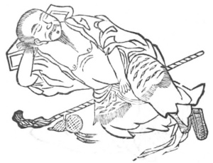

  
[Intangible Textual Heritage](../../index)  [Taoism](../index.md) 
[Index](index)  [Previous](kfu060)  [Next](kfu062.md) 

------------------------------------------------------------------------

  
*Kung-Fu, or Tauist Medical Gymnastics*, by John Dudgeon, \[1895\], at
Intangible Textual Heritage

------------------------------------------------------------------------

No. 33.—The pure peaceful Heavenly Preceptor's Sleeping Kung.—To cure
spermatorrhœa from dreams.

 

p. 187

Recline on the back, the right hand supporting the head (as a pillow),
the left hand grasping firmly the obscure parts, extend the left leg
straight, flex the right leg, let the heart think, and revolve the air
24 times.

The above is elsewhere termed—The Sleeping Exercise of Ch‘ên Tu‘an.—For
the cure of consumption and the effects of venery.

Recline obliquely on a pillow, with the right hand under the head; with
the left rub the abdomen, draw up the legs, the left not quite up to the
level of the right, the left pressing on the right, breathe gently,
vacant in thought, and take into the abdomen 32 mouthfuls. Do this 12
times. If long continued, the disease is certain to be cured.

Another similar exercise is simply termed—The Sleeping Method.—For the
cure of nocturnal emissions.

Lie on the back and make a pillow of the right hand, with the left hand
press on the thigh of the extended left leg, draw up the right leg,
think, and inspire 24 mouthfuls.

There is yet another Sleeping Method, for the cure of dyspepsia.

With both hands rub up and down the abdomen in all directions, like the
whirling of a river or the eddying of the ocean.

The Nourishing-heart Soup.

*Prescription*.—Take of ginseng, shan-yao, mu-t‘ung, fu-shên,
swan-tsao-jên (\#), seeds of Diospyros lotus, kwei-shên, clarified
tang-kwei, pai-shao, yuen-chih flesh (pulp), lien-hsü (\#) \[same as
lien-jui\], of each the same quantity. Add ginger, jujube, and lotus
pulp. Make a decoction, and take.

------------------------------------------------------------------------

[Next: No. 34.—Sun Hsuen-hsü imitating the Black Dragon taking hold of
his Claws](kfu062.md)

