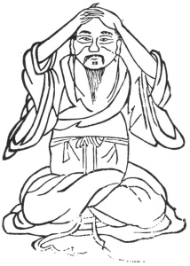

  
[Intangible Textual Heritage](../../index)  [Taoism](../index.md) 
[Index](index)  [Previous](kfu063)  [Next](kfu065.md) 

------------------------------------------------------------------------

  
*Kung-Fu, or Tauist Medical Gymnastics*, by John Dudgeon, \[1895\], at
Intangible Textual Heritage

------------------------------------------------------------------------

No. 36.—Fu Yuen-hsü (\#) embracing the Vertex.—To cure vertigo.

 

p. 191

Sit upright, rub the two hands warm and embrace the vertex door
(anterior fantanelle), shut the eyes to prevent the animal spirits from
being dissipated, blow, hem, and drum the air to cause it to ascend to
the top of the vertex; revolve the air 17 times.

The Rhubarb Soup.

*Prescription*.—Take of the best rhubarb, and digest it in wine 7 times;
dry, and then powder. Use tea, and take 3 mace for a dose.

------------------------------------------------------------------------

[Next: No. 37.—The immortal Li Hung-chi admiring the Moon](kfu065.md)

