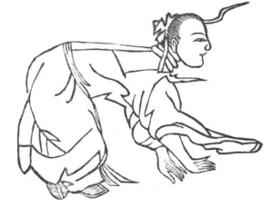

  
[Intangible Textual Heritage](../../index)  [Taoism](../index) 
[Index](index)  [Previous](kfu064)  [Next](kfu066) 

------------------------------------------------------------------------

  
*Kung-Fu, or Tauist Medical Gymnastics*, by John Dudgeon, \[1895\], at
Intangible Textual Heritage

------------------------------------------------------------------------

No. 37.—The immortal Li Hung-chi (\#) admiring the Moon.—This Figure is
designed to harmonize the air and invigorate the blood.

 

Bend the arms as if prostrating one's self to do obeisance; cross the
hands and feet, crawl along on the ground, practise the kung right and
left, and revolve the air each in 12 mouthfuls.

Harmonizing the Air and Nourishing the Blood Soup.

*Prescription*.—Take of tze-su (leaves of the stem), 1 mace,
ch‘iang-hwo, 1 mace; pan-hsia, tsang-pai-p‘i (\#), root bark of the
mulberry (Morus alba), ch‘ing-p‘i, orange peel, ta-fu-p‘i (\#) same as
betel-nut, of each 8 candareens; ch‘ïh-fu-ling, mu-t‘ung, of each 8
candareens; ch‘ih-shao (same as pai-shao), 1 mace; liquorice 5
candareens, tang-kwei 1 mace, and jou-kwei 3 candareens. Make a
decoction.

------------------------------------------------------------------------

[Next: No. 38.—Li T‘ieh-kwai the Immortal leaning on his Staff](kfu066)

