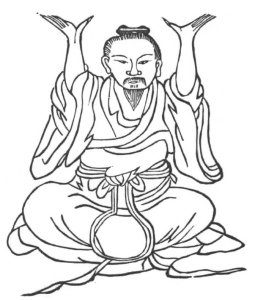

  
[Intangible Textual Heritage](../../index)  [Taoism](../index.md) 
[Index](index)  [Previous](kfu070)  [Next](kfu072.md) 

------------------------------------------------------------------------

  
*Kung-Fu, or Tauist Medical Gymnastics*, by John Dudgeon, \[1895\], at
Intangible Textual Heritage

------------------------------------------------------------------------

No. 43.—Ho T‘ai-ku supporting Heaven, seated.—To cure swelling of the
abdomen from debility.

 

Seated upright the two hands are raised as if supporting a thing, move
the air, and by upheaval lead the air upwards in 9 mouthfuls, then make
it descend in 9 mouthfuls.

p. 198

The above is sometimes called—Supporting the Pagoda towards Heaven.—For
the cure of enlargement of the abdomen. (Compare this with standing
Figure No. 11 of Chang Tze-yang driving the Pestle).

The Fragrant Sha Ling and P‘i Potion.

*Prescription*.—Take of fu-ling-p‘i, ta-fu-p‘i, wu-chia-p‘i,
ginger-skin, ts‘ang-pai-p‘i, root bark of mulberry, chïh-ch‘ioh,
sha-jên, pai-chu, lo-fo-tse, mu-hsiang, mu-t‘ung, tse-hsïeh, chu-ling,
of each the same quantity. Boil, to be taken a little while after meals.

------------------------------------------------------------------------

[Next: No. 44.—Liu Hsi-ku exhibiting terribly the Ferocious
Tiger](kfu072.md)

