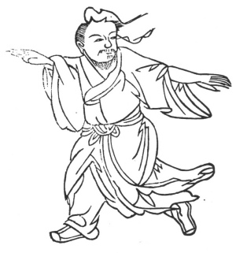

  
[Intangible Textual Heritage](../../index)  [Taoism](../index.md) 
[Index](index)  [Previous](kfu071)  [Next](kfu073.md) 

------------------------------------------------------------------------

  
*Kung-Fu, or Tauist Medical Gymnastics*, by John Dudgeon, \[1895\], at
Intangible Textual Heritage

------------------------------------------------------------------------

No. 44.—Liu Hsi-ku (\#) exhibiting terribly the Ferocious Tiger.—To cure
dysentery.

 

p. 199

Place the two hands in front and behind (one in front, the other
behind), like grasping a horse and putting aside flowers, the feet also
to be placed in front and behind, and take steps in performing the
exercise. For white dysentery, let the air advance directed to the left
in 9 mouthfuls; for red dysentery, the same to the right.

The Yellow Wax Pills.

*Prescription*.—Take of yellow wax 1 ounce; almonds 49, digested in
water to strip off the skin and the point (the latter supposed to be
poisonous); mu-hsiang, 5 mace; 7 croton seeds, Croton Tiglium (fold them
in paper and beat to express the oil); melt the wax, and mix in the
ingredients to make pills the size of green peas. Dose 15 for red
dysentery, to be taken with liquorice soup; for the white variety, use
ginger as a menstruum.

------------------------------------------------------------------------

[Next: No. 45.—Miss Sun Pu-erh waving the Flag](kfu073.md)

