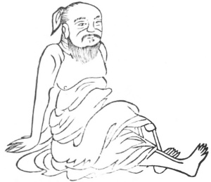
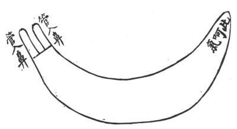
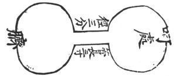

  
[Intangible Textual Heritage](../../index)  [Taoism](../index.md) 
[Index](index)  [Previous](kfu075)  [Next](kfu077.md) 

------------------------------------------------------------------------

  
*Kung-Fu, or Tauist Medical Gymnastics*, by John Dudgeon, \[1895\], at
Intangible Textual Heritage

------------------------------------------------------------------------

No. 48.—The Patriarch of P‘êng's (\#) [\*](#fn_17.md) Method of brightening the Vision.

 

p. 203

Sit on the ground firmly, reverse the two hands and place them behind,
extend the left leg, flex the right knee and press it upon the left leg
equal to a period of 5 respirations, and induce the lungs to drive out
the wind. If this attitude be assumed for a long time, things at night
will be seen as clear as day.

Another method is at cock-crow to rub the two hands warm, and iron (as
it were) the eyes; rub thrice and iron the eyes as often; then take the
finger and rub the eyes, and right and left will become divinely
brilliant.

The Ti-hwang Pills (same as Shêng-ti; sea No. 8) for clearing the Eyes.

*Prescription*.—Take of shêng-ti (washed in wine), shu-ti (the same), of
each 4 ounces; chih-mu (roasted in salted water), hwang-p‘o (roasted in
wine), of each a ounces; cakes of Cuscuda (Dodder) seeds, t‘u-szu-tzu
(\#) prepared in wine, tu-hwo, of each 1 ounce; kan-kow-chi,
chw‘an-niu-hsi (washed in wine), of each 3 ounces; sha-yuen-chi-li (\#),
seeds of an unknown plant, 3 ounces. Powder, and with honey make pills
the size of the wu-t‘ung-tse (seeds of sterculia platanifolia). Dose, 80
pills. In summer, use weakly-salted water as a menstruum. After more
than a month, use wine in taking it.

These exercises conclude with a description of three Figures. The first
is a pipe or reed (see Figure below), which is introduced into the two
nostrils 3 *fên*, and in calibre must fit exactly the nostrils, so as to
allow no leakage of air. The tube is pervious, and the apex has an
aperture for blowing into. It is employed in constant coughing, in
profuse perspiration, body hot, voice hoarse or lost, loss of flesh and
constitutional weakness. In the case of hæmoptysis, a cure is guaranteed
in seven days by its use. It is only necessary to hem or flow into the
tube.

p. 204

To cure red sputum, each time the instrument is used, a small cupful of
*hsiang-ch‘an*, \# (a venereal medicine, very costly and highly
esteemed, said to be produced from a toad's forehead, and coming from
the south); woman's milk, two eggs, and pig's pancreas cut very fine.
Mix the whole thoroughly, then put it in a porcelain vessel or silver
wine-cup, steam it until well done, and take it every morning for seven
days on an empty stomach at the same time as blowing into the pipe.

 

The second Figure is designed against fulness of the chest, and weakness
of the air (constitution). The instrument (see Illustration below) is to
be placed on the navel. It will also cure amenorrhœa and spermatorrhœa.

p. 205

Before blowing into it, take 3 *li* of musk (10 li = 1 *candareen*), gum
olibanum 1 mace; catechu, myrrh, and sandal wood, of each 1 mace.
Powder, and with honey form into cakes, one cake to be applied to the
navel. Take 1 slice of ginger, the size of the cake and half the
thickness of a cash (Chinese copper money); take the artemisia
(Tanacetum Chinense) and make into a pill or tuft the size of a bean
(number unimportant), and burn till the ginger is hot. When the heat is
felt inside, remove the medicine and blow into the instrument. No second
application is necessary.

 

The third instrument (see Figure below) is to be inserted two *fên* into
the meatus urinarius, for the cure of spermatorrhœa; to be introduced
smeared with wax. The blowing into it is to be according to the age of
the patient, one blow for each year; the number may be increased, but
not diminished.

From 5 to 7 days before commencing the use of the instrument, whether
the patients be male or female, the body is to be strengthened by the
use of good wine, flesh and rice, that the improvement may be speedy.

p. 206

 

In the fourth illustration (a tube resembling a rib), the patient
reclines on the back with warm water or olibanum wine in the mouth;
afterwards a young man is to blow into the tube according to the above
directions. The following is the method.

Take red lead, etc. (a disgusting preparation made from the menstrual
discharge, and so called because of its resemblance to red lead);—the
details are hardly fit for publication in English.

A portion is dropped into the small end of the tube and placed in the
nose; the youth then blows into the other end with all his force; the
sick person waits till he experiences the \#. Onions and garlick and all
sorts of acid and acrid things are to be avoided. This plan, if followed
for a long time, will add to one's longevity. If, after using the
method, warmth is felt inside, woman's milk may be drunk.

------------------------------------------------------------------------

### Footnotes

[202:\*](kfu076.htm#fr_17.md) The
[Patriarch](errata.htm#11.md) of Pang is a mythical being, who is reputed
to have attained a fabulous longevity. He was 767 years of age when the
Yin dynasty came to an end (1123 B.C.). He is said to have nourished
himself upon the powder of mother-o’-pearl and similar substances. By
some be is regarded as one of the incarnations of Lau-tse.

------------------------------------------------------------------------

[Next: Extra Curative Kung without Prescriptions](kfu077.md)

