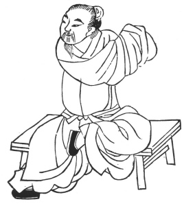
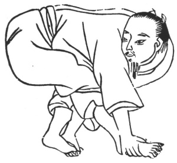

  
[Intangible Textual Heritage](../../index)  [Taoism](../index) 
[Index](index)  [Previous](kfu076)  [Next](kfu078) 

------------------------------------------------------------------------

  
*Kung-Fu, or Tauist Medical Gymnastics*, by John Dudgeon, \[1895\], at
Intangible Textual Heritage

------------------------------------------------------------------------

p. 207

### Extra Curative Kung without Prescriptions.

In a work copiously and beautifully illustrated on Kung-fu, which
apparently has been abstracted from my library but of which I made a
translation and had the most striking illustrations copied and cut
nearly 30 years ago, I find many of the illustrations and descriptions
with unimportant variations in other and later works on the subject,
some of which have already been presented to the reader. The titles of
some of the kung are altered, and the positions slightly varied; the
description of the exercises is very closely adhered to in all. The
titles are in most cases very poetical and graphic, and are supposed to
be suggested by the attitudes. To save space, incorporation has been
attempted. Repetition both in letter-press and figures is sought to be
avoided, and only the more striking ones are presented. These curative
exercises are followed by prophylactic ones, including the Dragon and
Tiger series.

No. 1.—The Patriarch Lü's Method for separating the Roads (the supposed
vessels proceeding to the various viscera).—For the cure of weakness of
the pulses of these vessels.

The Figure is similar to that for the middle of the Fifth month of the
series for the Year.

No. 2.—The Patriarch Lü’s Method for distributing and regulating the air
that has become stationary.—To cure spermatorrhœa.

This Figure is identical with that of the middle of the Ninth month of
the Year's kung.

No. 3.—Pa Wang raising the Incense Burner. (If the cock crow at the
first watch, fires are prevailing; if at the second, thieves).

The Figure is similar to that of the middle of the Fourth month of the
Year's series.

p. 208

No. 4.—Ursa Major's Tail opening what is closed.—For the cure of all
miscellaneous diseases.

Sit erect with both hands on the legs and bend the head and body, now to
the right, and then to the left, and take in 14 breaths.

No. 5.—For the cure of chronic abdominal growths.

Sit straight, rub the ribs of both sides, and the part over the tumours;
and while rubbing inspire 34 times.

No. 6.—The Etiquette of the Immortals.—For the cure of paralysis.

 

p. 209

Sit on a high seat, the left foot placed on the opposite thigh, and the
right extended forwards; clasp both hands, and, with the head turned in
the opposite direction, stretch out the clasped hands in the other, and
*vice versâ*, inspiring 34 times.

No. 7.—For the cure of Lumbago and Sciatica.

 

Both hands together, bend them to the ground slowly; raise them up again
quietly straight above the head; shut the mouth, and breathe through the
nose 3 or 4 times.

No. 8.—For the cure of cold of the Kidneys, with pain in the back and
limbs.

Both hands are made warm and pressed against the lumber region. (See
Ornamental Sections, No. 4).

p. 210

No. 9.—Li Peh [\*](#fn_18) enjoying the
Moonlight.—For the cure of stoppage of the blood.

 

The position is like beating a serpent. Grasp the feet with the hands,
reverse the hands, and take 12 breaths.

No. 10.—Moving the "Heavenly Pillar."—For the cure of headache,
rheumatism and imperviousness of the blood vessels.

Place both hands on the knees, twist the head to both sides, and take 12
inspirations. (See Ornamental Sections, No. 2).

p. 211

No. 11.—The Patriarch Lü's Method for curing Disease, caused by the
blocking up of the vessels with the blood and air.

Stand, and if on the left raise the left hand, and *vice versâ*.

No. 12.—For the cure of diaphragmatic dyspepsia.

Let the left hand be thrown to the left side, and let the fight hand
follow it with the head thrown in the opposite direction, and *vice
versâ;* to be repeated on each side 9 times. (The illustration resembles
that of the Solar Term of the Tenth month).

No. 13.—The Patriarch's Lü's Method for separating the Air.—For the cure
of stiffness of the body.

With closed fists press on both ribs on a level with the hollow of the
breast (the ensiform cartilage at the bottom of the heart), and use
strength internally in breathing on both sides 24 times.

No. 14.—To harmonize the blood vessels, the three divisions of the body
(upper, middle and lower parts of the trunk, into which the Chinese
divide the body), and to cure indistinctness of vision and weakness.

Sit cross-legged and rub the hands till warm, and then rub the soles of
the feet; then press both hands on the knees, open the mouth, and
inspire deeply 9 times.

No. 15.—Pa Wang's Walking Method.—For the cure of painful contraction of
the whole body caused by cold.

Stand, and with the hands press closely upon the part above the crest of
the ilium, first on one side, then on the other, in three positions,
with one leg forward. Repeat 12 times. (See Dragon series, No. 2).

------------------------------------------------------------------------

### Footnotes

[210:\*](kfu077.htm#fr_18) Li Peh, the most
widely celebrated among the poets of China. He derives his name,
T‘ai-peh, from the planet Venus, which is said to have shot down and
entered the bosom of his mother. The Imperial Courtier, Ho Che-chang of
the T‘ang Emperor, on hearing of his remarkable talent, exclaimed—"This
is indeed an Immortal banished to earth." (See the author's article on
*The Beverages of the Chinese*, for further notice of the Poet).

------------------------------------------------------------------------

[Next: The Dragon Series](kfu078)

