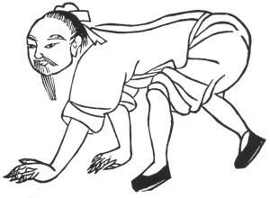
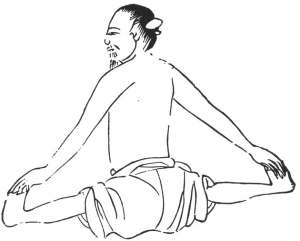
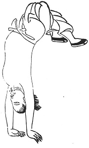

  
[Intangible Textual Heritage](../../index)  [Taoism](../index.md) 
[Index](index)  [Previous](kfu078)  [Next](kfu080.md) 

------------------------------------------------------------------------

  
*Kung-Fu, or Tauist Medical Gymnastics*, by John Dudgeon, \[1895\], at
Intangible Textual Heritage

------------------------------------------------------------------------

p. 216

### The Tiger Series.

The Tiger is the greatest of the four-footed creatures, the lord of wild
animals, and represents the masculine principle of nature. He lives for
a thousand years. When 500 years old, he becomes white. His claws act as
a talisman; and the ashes of his skin, when worn about the person, act
as a charm against disease. In Tauist literature, the Dragon and the
Tiger play a most important part.

No. 1.—The Mountain-Jumping Tiger.

Jump from one place to another, and then back, 24 times. In this way,
the black dragon and white tiger are brought face to face, and the door
of the hill (to become genii) will be opened.

 

No. 2.—The Tiger coming out of the Cave.

The person, on all fours, moves backwards and forwards, each 12 times.
The muscles and bones are thus made and kept movable, the viscera enjoy
peace, and the blood and veins flow regularly.

p. 217

No. 3.—The Flying-Rainbow Tiger.

The two arms are stretched out together in one direction, first to the
left and then to the right, 24 times, as if flying to the right and to
the left. This opens the chest, and makes it feel comfortable. The
muscles, bones and heart are likewise benefited, and so disease is
prevented. (The illustration resembles those for the Second and Tenth
months of the Year's Series).

No. 4.—The Relaxing-Tendon Tiger.

 

Both legs are stretched out flat on the ground from the body right and
left, with the arms grasping the feet like the string of a bow, turning
to the right and left 12 times each way. With the view of moving the
muscles, ligaments and bones, preventing the production of disease, or
removing it far off.

No. 5.—The Tiger suspended from a Beam.

Suspended from a cross-bar, weigh the body, first on one hand, then on
the other, 24 times; and all manner of diseases will vanish, the air and
blood will circulate, and the viscera be made comfortable.

p. 218

No. 6.—The Tiger fixed like the Tripod of an Incense Burner.

Sit cross-legged and straight, with hands at the side like a tripod
firmly fixed, with the shoulder placed straight, and the head thrown up
24 times. This is considered great *kung-fu*, and calculated to produce
great good.

No. 7.—The Standing-on-one-Leg Tiger.

First on one side, and then on the other, each 12 times. To give peace
to the bones and ligaments of the entire body.

No. 8.—The Turning-his-Body Tiger.

 

p. 219

As if the feet were flying, and the two hands on the ground supporting
the body. To be done 24 times without stopping. To prevent the air
stopping anywhere, and causing debility and laziness of the body.

No. 9.—The Tiger turning himself.

The hands are turned with palms backwards, and the shoulders are grasped
firmly 81 times. Used for broadening the chest, and causing the blood
and air to move constantly. (The illustration is similar to No. 3, of
the Medicinal Kung).

No. 10.—The Tiger swallowing Saliva.

The saliva to be swallowed 24 times. To diminish the fire (inflammation)
of the heart.

No. 11.—The Peach-Blossom Tiger.

The face is to be roughed with both hands, the voice is to be thrown out
by pronouncing *ha* until the face is red and quite hot, and there are
no wrinkles, and the face is as if the person had been drinking. [\*](#fn_21.md)

No. 12.—The Peaceful Spirit Tiger.

Sit cross-legged, to pacify the heart, as if looking at a beautiful
garden or picture.

p. 220

No. 13.—The Tiger (a lady) playing the Dragon's Flute.

There are no holes in the sides; therefore played at the end If it be
not blown, the air can not enter; and, if the air do not enter the road
is not open; and, if the road be not open, the *tan-t‘ien* air does not
move, and the person is not able to play. If it succeed, then the
*tan-t‘ien* air passes to the "Heavenly Door," and so round the entire
body, according to diagram illustrative of the *Physiology of Kung-fu*
(inserted at the end).

No. 14.—The Dragon (a man) playing the Tiger's Guitar.

To cause the heart to desire and wish for things, and then both their
hearts will be joyful and contract no disease (different musical
instruments are recommended).

Then follows—*The Dragon asking the Tiger the News*, and *The Tiger (a
lady) arriving at the Village of the Dragon*. The illustration is unfit
for publication.

------------------------------------------------------------------------

### Footnotes

[219:\*](kfu079.htm#fr_21.md) The peach tree is an
emblem and symbol of longevity, and derives much of its allegorical
character from a reference to it in the *Book of Odes*. It occupies too
a prominent position in the mystical fancies of the Tauists. Magical
virtues were very early attributed to twigs of this tree, and its use in
making handles, beating down earth with the view of driving away demons,
is in constant demand, and originally in writing charms to be placed
over the doors at the New Year to drive off evil spirits. The pilgrims
to Miao-fêng-shan, in the Fourth moon, bring back peach sticks to ward
off evil spirits. A host of superstitious notions cluster around the
peach-wood,—many of a magical nature. It yielded the fruit of
immortality. According to Mayers, one of the panaceas of the Tauists was
said to be composed of the peach tree mingled with the powdered ash of
the mulberry, which not alone cured all diseases but also conferred the
boon of immortality.

------------------------------------------------------------------------

[Next: Kneading](kfu080.md)
