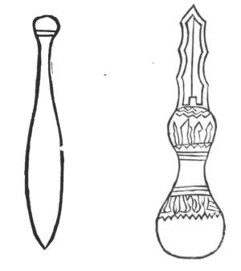

  
[Intangible Textual Heritage](../../index)  [Taoism](../index.md) 
[Index](index)  [Previous](kfu082)  [Next](kfu084.md) 

------------------------------------------------------------------------

  
*Kung-Fu, or Tauist Medical Gymnastics*, by John Dudgeon, \[1895\], at
Intangible Textual Heritage

------------------------------------------------------------------------

### METHOD FOR ACQUIRING THE ESSENCES OF THE SUN AND MOON.

(The important thing is to have the lungs full of air). The two essences
of the Sun and Moon must unite to produce the myriad things of nature.
The ancients swallowed these essences and in time became genii. The
method is secret. People in the world are ignorant of it. Even among
those who know it, their will not being strong and with want of constant
practice, it becomes useless. Although those who daily exercise the kung
are few, yet if it is done from the beginning and continued until it is
complete and until death, whether at leisure or busy and whether or not
there is any outside business, if only it is done daily and constantly,
one can become an immortal without much difficulty. By receiving and
swallowing it, the essence of the sun and moon is added to the spirit
and intelligence and then ignorance and all crudities are dissolved and
the person feels full of vigour and is very efficient and the myriad
diseases are not developed. Truly the benefit is great. The method is
daily on the first of the month (shuo) when the air is new and fresh and
during the last half (*wang*) when metal and water (two of the 5
elements) are full and the air is perfect and progressive, at this time
one can obtain the lunar essence.. If it rain or be cloudy on any of
these days, or if from want of leisure on those days, the and, 3rd and
16th and 17th will also do, and so can also increase the vigour and
essence; if after these six days when the sun is inclining to the West
and the moon becomes smaller and

p. 237

weaker their essence is insufficient and therefore unimportant to
health. In speaking of the sun, its essence ought to be swallowed on the
1st and 15th between 3 and 7 a.m. One must go to a high place, opposite
the sun, remain perfectly still, harmonize the air inspired by the nose
and slowly inhale the solar essence one full mouthful, then close the
respiration, collect the animal vigour, and slowly swallow it little by
little and thinking, let the idea introduce it into the Central Palace
(the tan-t‘ien). This is the manner of performing one act of deglutition
and it must be repeated 7 times. Then stop a little, retaining it, after
which you may repair home and attend to your ordinary
[business](errata.htm#22.md) without inconvenience. During the lunar
diminution (the sun and moon are said to be full on the 1st and 15th
respectively) also according to the foregoing method from 7 to 11 p.m.,
also 7 times repeated. This is the principle pervading heaven and earth;
if one pursues it with a constant and fixed heart, great advantage can
be obtained; those who believe it can lay hold of it and use it. This is
the method for performing a very large and important Kung. Do not reckon
it unimportant and make no mistake in regard to it.

In refining the animal vigour. by external exercises we use kneading and
at the time of practising the exercise, a medicine pill is taken,
swallowed and when it is conjectured, that it is dissolved (in the
stomach), use the kneading; the strength of the pill unites with the
kneading and thus the advantage is obtained. No benefit accrues from
beginning the kneading before the pill has dissolved nor long after it
has dissolved. Knead and take a pill once in three days and continue in
this manner. (The ingredients of the pills have been already given).

Another matter to be attended to under kung-fu is constantly washing and
bathing the body in brine. The salted water can make the hard soft and
disperse the heat. It is performed daily or once in two days. The
prescription is to take of the root-bark of Lycium Chinense and salt, of
each *ad libitum*, in warm water and thus the blood and air will
harmonize and the skin and epidermis will feel most comfortable.

The third thing calling for attention is the wooden pestle and mallet,
both of which are made of hard wood. The pestle is 6 inches long, the
mid part ½ inch in diameter, the head round,

p. 238

the tail, sharp (a knob at one end and a point at the other end). The
mallet is 1 foot long, 4 inches in circumference; the handle is slender
at the upper part, the top is thick with a knob at the end of the handle
and at the middle the body of it a little higher. (See illustrations).

 

The fourth thing is the pebble bag. It is necessary to beat the muscles
with the wooden pestle and mallet but the joints must be exercised with
the pebble bag. It is made of linen cloth, in form not unlike the pestle
and of three different sizes, the major one eight inches long, and one
catty in weight; the medium one 6 inches long and 12 ounces in weight
and the minor one 5 inches long and half a catty in weight. The size of
the largest pebbles must not exceed the size of the grape and the
smaller, the pomegranate seed, and only those must be used which have
been found in water and are free from edges and corners.

p. 239

*Kung-fu for the First Month*. At the beginning of kneading a succession
of little boys is required for they possess little strength, and so
knead not so heavily and their animal vigour is strong. First swallow
the pill and just as it begins to digest commence the kneading; the
advantage is to be gained when the two go hand in hand. On beginning the
kneading the dress on the breast must be opened, recline and place the
palm of the hand on the part below the heart and above the navel, and
knead from the right to the left, slowly coming and going, not so light
that the hand leaves the skin and not so heavy as to press heavily upon
the bones, and not to be performed confusedly. This is the proper mode.
While kneading, the heart must look inwards *i.e.*, denuded of all
external thought and the idea guarded in the "medium" and the thoughts
not allowed to roam outside and thus the essence, the air and the
spirit, are all below the palm. This is truly the golden mean (hwo how
\#). At this period there is no scattering of the thoughts, and the
kneading is equalized. If this condition is attained, one can sleep
during the process and the method is all the more remarkable; the
*show-chung* idea is better when the person is asleep. The duration of
the exercise must be about the time taken to burn two sticks of incense,
each day thrice, morning, noon and evening. If the person be young and
strong, twice daily, morning and evening, will be sufficient, if more
frequently performed harm might be the result. After kneading, a short
sleep is advisable after which other business may be engaged in without
detriment.

*Kung fu for the Second Month*. The animal vigour has accumulated during
the first month, the stomach has become large and broad, and the sinews
on the sides of the abdomen have been raised over one inch, and can,
when pressed with air, become as hard as wood or stone. This is the
result. But the space between the sinews from the heart to the navel is
still soft and hollow, because the membranes are deeper than the sinews
and the palm kneading has not yet reached them and consequently they
have not risen. This time, knead by the side of the palm so as to open a
\[another\] palm according to the former method and pound deeply the
soft parts with the wooden pestle and after a time the membranes will be
raised above the skin and possess the same strength as the sinews,
without being either soft or hollow and this is the complete kung. The
period occupied

p. 240

by kneading and pounding must be that of two sticks of incense thrice
daily, and daily by the use of this exercise no defect will be
developed.

*Kung-fu for the Third Month*. After two months’ exercise, the hollow
space in the centre is a little raised; and then gently beat with-the
wooden mallet on the kneaded portion of the two sides of the first palm
"width" and pound with the wooden pestle the parts which reach the end
of the two great sinews one "palm wide" according to the kneading
method. The time occupied is to equal the time taken in burning two
sticks of incense thrice daily.

*Kung-fu for the Fourth Month*. Three months’ exercise being now
completed, the three middle "palm-wide" parts are all beaten by the
wooden mallet and the external two "palm-wide" parts are first pounded,
then beaten, thrice daily, for a period equal to the burning of each two
sticks of incense. After exercising over 100 days, the air becomes full,
the sinews strong, then the membranes raised and thus advantage is
reaped.

*Light and heavy Method of performing the Kung*. In beginning the
exercises, light manipulation is of the first importance, and a young
boy must be employed because his strength is even; after one month when
the air has slowly increased the strength can be increased; it must not
be used too strongly in case inflammation should be set up; it must be
pursued in strict order and not confusedly in case the skin should get
injured, therefore care. must be exercised.

*Deep and superficial Method of performing the Kung*. In the beginning
the exercise is superficial, the strength increases daily, because the
air is becoming stronger and therefore the weight may be gradually
increased although it is still superficial. Following this the pestle is
used to pound which can be done deeply and afterwards beat and although
the beating outside. is shallow, the movement is felt deeply inside and
this is to make both the inside and outside strong and in this way
benefit accrues.

*Internal and external Kung-fu for the ribs*. The animal vigour is full
when the kung have been performed over 100 days, like a mountain torrent
which is full to the brim (margin) and there is no place to which it
cannot flow if a channel be left for it. At this time therefore
precautions must be adopted to keep the air from escaping to the four
extremities by improper pounding or beating outside the kneaded portion,
otherwise if there is the slightest idea.

p. 241

of conducting it elsewhere, it will become external strength
(robustness.) If once the animal vigour has thus become external, it
cannot be brought back and made to enter the bones and so cannot become
the internal robustness. In order to make it enter inside, the pebble
bag already described is used and beginning at the "mouth of the heart"
(breast) and proceeding to the end of the ribs, the space between the
bones and muscles must be closely pounded, again kneading and beating
the m after a long time the animal vigour which has accumulated will be
led to the bones and not over-flow to the limbs. This is the internal
robustness. Here the distinction between inside and outside is to be
observed and maintained; if not clearly differentiated in such actions
as drawing the bow, moving the fists, beating or grasping a thing, the
air will proceed to the outside and can never be brought back to the
inside, so it is necessary to use the utmost care.

*Kung-fu for the Fifth, Sixth, Seventh and Eighth Months*. The exercises
on the ribs have now been performed for over 100 days and we have
already beaten with the pebble bag and kneaded from below the "mouth of
the heart" to the end of the ribs on the two sides, that is the part
where the clefts of the bones unite, and where the external and internal
robustness divide. If at this place it is undesirable to lead the vigour
to the outside, the accumulated air can enter the fissures of the bones
following the course of the beating. One ought to beat from the breast
to the neck and from the ends of the ribs to the shoulder, performing
revolution after revolution in this manner but never retrograding,
thrice daily, occupying the time taken to burn six sticks of incense.
This Kung must be done continuously and without intermission for 100
days when the breast in front becomes full, and the fen pulse also full.
The Kung-fu is now half finished.

*Kung-fu for the Ninth, Tenth, Eleventh and Twelfth Months*. When the
Kung-fu has been performed for 200 days, the animal vigour in the front
of the chest is full and the *Jen* pulse full, the vigour must be
transferred to the back and made to communicate with the *Tu* pulse. The
air has already reached to the shoulder and neck. The former method must
be pursued in beating and kneading, going upwards to the occiput, in the
middle of the spine between the scapulae and downwards to the coccyx
beating each part and

p. 242

returning and repeating the operation and never retrograding. The soft
parts on the sides of the spine must be kneaded with the palm or pounded
and beat by the pestle and mallet thrice daily, occupying the time taken
to burn six sticks of incense, whether above or below, right or left
kneading or beating one revolution. In this way in 100 days the back
will be full of air, and dissipate all manner of disease and the *Tu*
pulse full to overflowing. After each beating it must be rubbed with the
hand in order to make it uniform.

We have omitted here several sections, partly as unimportant but chiefly
as being quite unfit for publication. One is entitled the Method of
Pairing the Yin and Yang principles. Another is called the Method for
applying kung-fu to the Lower Portion of the body. A third is termed
Things Forbidden in the Practice of Kung-fu. Then follows a prescription
for the washing of the Lower Portion of the Body, the object of which is
to cause the efficacy of the drugs to be communicated to the air and
unite with the blood in the system, to toughen the skin, dissipate the
heat and free the system from desire. The receipt is as follows. Take of
She-ch’wang-tse (\#), (Selinum Monnieri); root bark of Lycium Chinense
and liquorice *ad libitum*. Make a decoction, foment the parts once or
twice daily. The next section is entitled "Joining Battle."

*Internal robustness and "divine strength."* We have not yet exhausted
the subject of the internal and external energy, so must now exhibit it.
Since we have used the Kung by beating and kneading the ribs, the air
has reached to the joints, and the two pulses *Jen* and *Tu* have become
full, and the air has circulated and filled everywhere, and before and
behind have entered into communication, still we have not yet perceived
any great addition of strength. How then do we speak of strength
(energy) because the air (energy) has not yet reached to the hands. The
method for securing this is by the use of the pebble bag as already
described, beginning with the right shoulder beating bit by bit down to
the back of the middle finger, then from the back of the shoulder
beating down to the back of the thumb and forefinger and then again from
the front of the shoulders beating down to the back of the ring and
little fingers, and once more from the inside of the shoulder beating to
the palm and the end of the thumb and forefinger and again

p. 243

from the outside of the shoulder beating to the palms and ends of the
middle and little fingers. When the beating is finished, the hand must
rub and knead to make them uniform, thrice daily, time, six sticks of
incense. Also frequently washing with warm water in order to cause the
blood and air to flow together. After thus exercising too days, the air
has reached to all parts. The same exercises must be gone through with
the left hand for the same length of time and then by this time "divine
strength" is developed in the inside of the bones and in the course of
time go on adding exercise after exercise, the arm, the wrist, fingers
and palm will become totally different from what they were formerly.
Then taking hold of the idea and using energy they will become as hard
as stone and iron and the fingers will be able to go through a bullock's
abdomen and the palm on edge will be able to decapitate a bullock's
head. This is but a very small particle of the benefit to be derived
from kung-fu.

*To exercise in order to transport the superfluous strength to the
hands*. The plan to be adopted is constantly to bathe the hands in warm
water, at first warm, then hot, then very hot. Both palm and wrists
should be washed and after washing they should not be thoroughly dried
but shaken and so dried spontaneously. While washing the hands in this
way use force to press the air in order to make it reach to the points
of the fingers. This is the method to produce strength. Then fill a
vessel with mixed black and green peas and constantly dip the hands into
the vessel. The bathing and washing above mentioned was with the object
of harmonizing the blood and air, the object of the two sorts of peas is
to disperse and remove the "fire" poison; and the dipping is to
strengthen the skin by rubbing it. By using this sort of kung-fu for a
long time the accumulated air can be forwarded to the hand and the
strength thus become complete, and the skin, sinews and membranes will
mutually be strengthened and closely embrace the bones, neither soft nor
hard If not in use, it will be as with ordinary mortals, but in use and
the idea exercised, will become as strong as iron and stone and nothing
will be able to withstand it. This strength is developed from the bones
and is totally different from what is usually termed external
robustness. The difference between outside and inside robustness is to
be recognized by the sinews. In the internal, the sinews are long and
comfortable, the skin is fine and glossy and the strength

p. 244

is heavy (intense); in the external, the skin is coarse and tough; the
various sinews of the palms and wrists are coiled like the common
earthworm and apparent on the skin, and the strength although great, has
no root. This is the difference between the two.

*The External Robustness and Divine Strength of the Eight Ornamental
Sections*. Having now obtained the internal robustness, and the strength
of the bones firmly consolidated, afterwards it can be lead to the
outside, because the inside has a root and it can be driven from the
inside to the outside, and so become the root of the science. In
disciplining the outside kung there are the eight methods lifting,
holding up, pushing, pulling, clutching, pressing, seizing, and
overflowing. Perform these eight methods energetically, each method once
and repeat times without number, thrice daily about the time that six
sticks of incense would take to burn, and after a long time when the
kung is finished the whole body will be filled with strength. When
required it will be freely developed without fail. When people hear of
this they are thunderstruck. The ancients thought that lifting the
portcullis was a feat of marvellous strength (referring to a Herculean
feat of this sort performed by K‘ung shu-liang-ho, the father of
[Confucius](errata.htm#23.md) who was renowned for his great personal
prowess and unusual strength.) or the strength capable of lifting a
tripod (referring to Wu yün and Pa wang who could lift a tripod 1000
catties in weight—the latter the Hercules or Samson of China.) Practise
the above eight methods separately one after the other and the greatest
benefit is to be derived therefrom; if otherwise minded, follow the
exercise *sua volonte*.

*Added kung to the Divine Strength*. Internal and external kung being
now both complete, which can be termed Divine strength, but although
complete, it must afterwards be constantly employed and must not be
thrown aside at will. You must find out growing in the garden a large
tree, in order to obtain the air of the soil and wood which causes it to
grow and which is different from that of other localities. When you have
leisure you must proceed to the shade of the tree and according to your
own convenience practise the exercises, whether beating, or rubbing,
pushing, drawing, kicking or pulling up, in order to obtain the growing
energy of the tree to produce or excite your vitality and during leisure
can

p. 245

complete the kung-fu. Again search out a wilderness adjoining hills and
find a large erect stone that has grown beautiful and the finest to be
found and constantly resort to it and practise the pushing, pressing and
the other above mentioned exercises and obtain the auspiciousness of the
site and if you can obtain this air there is certainly great advantage.
In ancient times the Great *Shun* dwelt beside stones and wood and his
practice was not devoid of meaning.

*On the Method of Calculating and Revolving the Strength*, so as to
store up the energy in all parts of the body. The chapter is too long
and somewhat intricate for translation, and is therefore omitted.

These are followed by the Twelve Ornamental Sections which are simply an
amplification of the Eight already given. They are derived from the
Buddhist sect in which meditation is the all important thing. If one
proposes to practise these exercises the first thing is to close the
eyes, shut the heart, close [tightly](errata.htm#24.md) the hands; all
worldly affairs are to be banished, the heart must be perfectly pure the
breath harmonized, and then the spirit will be fixed, afterwards
performing the kung according to the order and forms given, the energy
and idea will react to the place desired. The exercise of the form
without the idea is useless; if the heart as governor wanders here and
there and the spirit and idea are both dissipated, the trouble of the
exercise is borne in vain; no good is to be derived from the kung. At
first in disciplining the movements, the heart and strength must both
have arrived \[at the place desired in the exercise\], this is the
movement, the peaceful repose, is the heart thinking of the number 30
times, and daily increasing up to 100 times, thrice daily and after 20
days the kung are complete. When the air and strength are obtained,
thrice daily will do, and when the air and strength are strongly
consolidated, once daily will do. The important thing in all these
exercises is that the idea constantly accompanies them.

------------------------------------------------------------------------

[Next: The Eighteen Disciplinary Records](kfu084.md)
