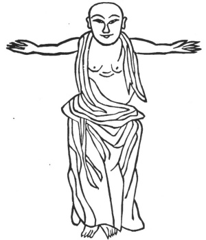

  
[Intangible Textual Heritage](../../index)  [Taoism](../index.md) 
[Index](index)  [Previous](kfu087)  [Next](kfu089.md) 

------------------------------------------------------------------------

  
*Kung-Fu, or Tauist Medical Gymnastics*, by John Dudgeon, \[1895\], at
Intangible Textual Heritage

------------------------------------------------------------------------

2.—The Second Aspect of Wei-to.

 

Apply the toes to the ground; stretch out the arms horizontally, with
quieted heart and silent breath, eyes wide open and mouth simple. See
No. 2.

------------------------------------------------------------------------

[Next: 3.—The Third Aspect of Wei-to](kfu089.md)

