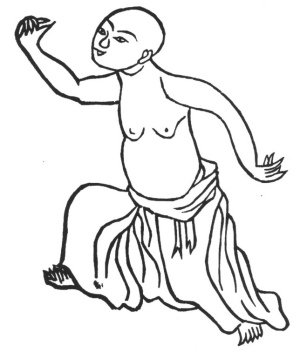

  
[Intangible Textual Heritage](../../index)  [Taoism](../index.md) 
[Index](index)  [Previous](kfu090)  [Next](kfu092.md) 

------------------------------------------------------------------------

  
*Kung-Fu, or Tauist Medical Gymnastics*, by John Dudgeon, \[1895\], at
Intangible Textual Heritage

------------------------------------------------------------------------

p. 259

5.—Pulling Nine Oxen's tails backwards.

 

Stretch one leg backward, the other bend forward.

Let the small abdomen (below the navel) loosely revolve the breath

Exert the power in the two shoulders.

And fix the eyes on the fist. See No. 5.

------------------------------------------------------------------------

[Next: 6.—Pushing out the Claws and Extending the Wings](kfu092.md)

