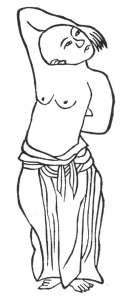

  
[Intangible Textual Heritage](../../index)  [Taoism](../index) 
[Index](index)  [Previous](kfu092)  [Next](kfu094) 

------------------------------------------------------------------------

  
*Kung-Fu, or Tauist Medical Gymnastics*, by John Dudgeon, \[1895\], at
Intangible Textual Heritage

------------------------------------------------------------------------

p. 261

7.—Nine Devils drawing a dagger.

 

Half turn the head and bend the arms.

Enfold the vertex and the cervix.

When turning back from the head.

Don't object that the force is terrible.

Set in alternate rotation.

With body upright and pure breath. See No. 7.

------------------------------------------------------------------------

[Next: 8.—Three Plates falling on the ground](kfu094)

