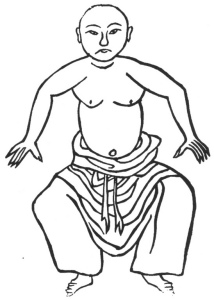

  
[Intangible Textual Heritage](../../index)  [Taoism](../index.md) 
[Index](index)  [Previous](kfu093)  [Next](kfu095.md) 

------------------------------------------------------------------------

  
*Kung-Fu, or Tauist Medical Gymnastics*, by John Dudgeon, \[1895\], at
Intangible Textual Heritage

------------------------------------------------------------------------

p. 262

8.—Three Plates falling on the ground.

 

The tongue firmly attached to the palate.

Open the eyes and fix the breath.

Standing with open feet in squatting form.

The hands pressing forcibly as if seizing some thing.

Turning the palms at the same time.

A weight more than a thousand catties seeming.

Open the eyes and shut the mouth.

Standing upright, the feet not aslant. See No. 8.

------------------------------------------------------------------------

[Next: 9.—The Azure Dragon stretching its Claws](kfu095.md)

