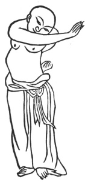

  
[Intangible Textual Heritage](../../index)  [Taoism](../index) 
[Index](index)  [Previous](kfu094)  [Next](kfu096) 

------------------------------------------------------------------------

  
*Kung-Fu, or Tauist Medical Gymnastics*, by John Dudgeon, \[1895\], at
Intangible Textual Heritage

------------------------------------------------------------------------

p. 263

9.—The Azure Dragon stretching its Claws.

 

Azure Dragon stretching its claws.

The left emerges from the right.

The exerciser imitates it.

Level the palms and deeply breathe.

Exert the strength on the shoulders and back.

Encircling around pass the knee.

Fix the eyes on the level.

The breath equalized, and the heart quiet. See No. 9.

------------------------------------------------------------------------

[Next: 10.—The Lying Tiger springing at his Food](kfu096)

