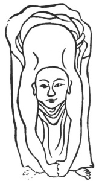

  
[Intangible Textual Heritage](../../index)  [Taoism](../index) 
[Index](index)  [Previous](kfu097)  [Next](kfu099) 

------------------------------------------------------------------------

  
*Kung-Fu, or Tauist Medical Gymnastics*, by John Dudgeon, \[1895\], at
Intangible Textual Heritage

------------------------------------------------------------------------

p. 266

12.—Wagging the Tail.

 

With upright legs and outstretched arms.

Pushing the hands to the ground.

Fix the eyes and raise the head.

Settle the thoughts and think of nothing else.

Raise the head and feet.

One and twenty times.

On each side stretching the arms.

Take seven as the limit.

Still more to perform the sitting kung.

Bend one leg under the other and hang down the eyelids.

Fix the mouth to the heart. Equalize the breath by the nose.

When enter the state of [quietism](errata.htm#28), then arise.

The exercise is then complete.

p. 267

Examine these methods.

There are 12 illustrations.

From the time of the Five Kingdoms.

Who has really learned this method?

Tamo came from the West.

Spread the doctrines at Shao-lin-sze.

In the Sung there was Yueh-how.

As an example.

Can cure disease and lengthen life's span.

These exercises are [unique](errata.htm#29) and incomparable. See No.
12.

------------------------------------------------------------------------

[Next: The Nine Figures to Remove Disease and Lengthen Life](kfu099)

