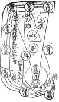
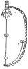

  
[Intangible Textual Heritage](../../index)  [Taoism](../index.md) 
[Index](index)  [Previous](kfu101)  [Next](kfu103.md) 

------------------------------------------------------------------------

  
*Kung-Fu, or Tauist Medical Gymnastics*, by John Dudgeon, \[1895\], at
Intangible Textual Heritage

------------------------------------------------------------------------

p. 286

### Diagrams illustrating the Physiology of Kung-fu.

1.—T‘ien men (Heavenly door) = the brow.

2.—Ni wan kung, Ni wan palace.

3—Sui hai kuh, the occiput, the marrow-sea, brain-sea.

4.—San chiao, the three divisions or functional passages.

5.—Fei, the lungs.

6.—Hsin, the heart.

7.—Hsin pau lo, the pericardium.

8.—Kan, the liver.

9.—Wei, the stomach.

10.—P‘i, the spleen.

11.—Hwang t‘ing tan t‘ien—the inner tan of the yellow pavilion.

12.—Ta chang, the large intestines.

13.—Siao chang, the small intestines.

14.—Shen, the kidneys.

15.—T‘ang kwang, the bladder.

16.—Ü ching shan (pearly-elevated hill) = 7th cervical vertebra.

17.—Chia phi; the dorsal vertebra.

18.—Wei lü, the os sacrum.

19.—Shang shui hia hwo wei chi chi chien ü lien low chi hia. Water above
and fire below combine and are seen below the connecting "upper story"
*i.e.*, the tan t‘ien below the breast and epigastriam = the *low* or
upper story according to the Tauists.

Tan chung chen shang sheng, the true fire in the tan t‘ien
[proceeds](errata.htm#33.md) upwards.

p. 287

  [  
Click to enlarge](img/28700.jpg.md)

p. 288

  [  
Click to enlarge](img/28800.jpg.md)

p. 289

It was intended in the sequel to describe the shampooing, rubbing,
pressing and other processes, of the fraternity of barbers, for the cure
of disease, the prolongation of life in the healthy, and the production
of a sense of comfort and the removal of fatigue, etc., but the space to
which this subject has already, unexpectedly and unfortunately attained,
renders it necessary to pass over this part of Kung-fu. A small cheap,
illustrated book in two volumes, The Barber's Classic, entitled
*Ching-fah-chi-chih* (\#) goal or how to obtain clean hair, may be
profitably consulted. The second volume treats, in part, of massage
applied to the various parts of the body. It treats, too, of the
acupuncture apertures, a knowledge of which is essential to the proper
practice of the art. It speaks of 84,000 pores, of 10 ching and 15 *lo*
(arterial vessels), and the merit accruing from the exercise of this
method which is modified by certain climatic and physical conditions,
such as the state of the weather, whether cold or hot, and the condition
of the patient, whether fat or lean, etc. The section' embrace massage
in general, and rubbing as applied to the aperture of the back and
loins, the hands and arms, bead and face, thorax and abdomen, and lower
limbs.

On the streets of the Capital there is a class of Pressers whose art is
known as tien p’i \# (pressing the skin). The generic name or the class
is tui na \#, For example: for the cure of pain of the temples, the part
below the sternum is pressed; for the cure of cold and pain, the part
below the ribs; for colic, the points of the fingers and lips; for
headache, the shoulders; for toothache, the facial artery, shoulder and
cleft of thumb and fore-finger; for cholera, the calf of the leg; for
general discomfort, the blood vessels.

------------------------------------------------------------------------

[Next: Conclusion](kfu103.md)
