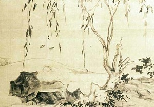

  
[Intangible Textual Heritage](../../index)  [Taoism](../index.md) 

------------------------------------------------------------------------

[Buy this Book at
Amazon.com](https://www.amazon.com/exec/obidos/ASIN/0486419460/internetsacredte.md)

------------------------------------------------------------------------

[Buy this Book on
Kindle](https://www.amazon.com/exec/obidos/ASIN/B002KCO7KA/internetsacredte.md)

------------------------------------------------------------------------

<table width="75%">
<colgroup>
<col style="width: 50%" />
<col style="width: 50%" />
</colgroup>
<tbody>
<tr class="odd">
<td width="50%" data-valign="TOP"> 
Zhuangzi and the butterflies</td>
<td width="50%" data-valign="CENTER"><h3 id="musings-of-a-chinese-mystic" data-align="CENTER">Musings of a Chinese Mystic</h3>
<h4 id="by-lionel-giles" data-align="CENTER">by Lionel Giles</h4>
<h4 id="section" data-align="CENTER">[1909]</h4></td>
</tr>
</tbody>
</table>

------------------------------------------------------------------------

[Contents](#contents)    [Start Reading](mcm00.md)    [Page
Index](pageidx)    [Text \[Zipped\]](mcm.txt.gz.md)

------------------------------------------------------------------------

|                                                                                                                           |
|---------------------------------------------------------------------------------------------------------------------------|
|  |

This short collection of texts featuring Chuang Tzu (Zhuangzi), the
Taoist sage, is a good introduction to the core concepts of the Taoist
worldview. The author, Lionel Giles, was an eminent Victorian scholar of
Chinese society, who, most notably, also translated [Sun Tsu's Art of
War](../../cfu/artwar.txt.md).

------------------------------------------------------------------------

 [Title Page and Front Matter](mcm00.md)  
[Contents](mcm01.md)  
[Note](mcm02.md)  
[Editorial Note](mcm03.md)  
[Introduction](mcm04.md)  
[The Doctrine of Relativity](mcm05.md)  
[The Identity of Contraries](mcm06.md)  
[Illusions](mcm07.md)  
[The Mysterious Immanence of Tao](mcm08.md)  
[The Hidden Spring](mcm09.md)  
[Non-Interference With Nature](mcm10.md)  
[Passive Virtue](mcm11.md)  
[Self-Adaptation to Externals](mcm12.md)  
[Immortality of the Soul](mcm13.md)  
[The Sage, or Perfect Man](mcm14.md)  
[Random Gleanings](mcm15.md)  
[Personal Anecdotes](mcm16.md)  
[Advertisements](mcm17.md)  
