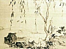

  
[Intangible Textual Heritage](../../index)  [Taoism](../index) 
[Index](index)  [Previous](mcm04)  [Next](mcm06) 

------------------------------------------------------------------------

[Buy this Book at
Amazon.com](https://www.amazon.com/exec/obidos/ASIN/0486419460/internetsacredte)

------------------------------------------------------------------------

[Buy this Book on
Kindle](https://www.amazon.com/exec/obidos/ASIN/B002KCO7KA/internetsacredte)

------------------------------------------------------------------------

  
*Musings of a Chinese Mystic*, by Lionel Giles, \[1906\], at Intangible
Textual Heritage

------------------------------------------------------------------------

p. 37

### THE DOCTRINE OF RELATIVITY

In the northern ocean there is a fish,
called the Leviathan, many thousand *li* [1](#fn_8) in size. This Leviathan changes into a bird,
called the Rukh, whose back is many thousand *li* in breadth. With a
mighty effort it rises, and its wings obscure the sky like clouds. At
the equinox, this bird prepares to start for the southern ocean, the
Celestial Lake. And in the *Record of Marvels* we read that when the
rukh flies southwards, the water is smitten for a space of three
thousand *li* around, while the bird itself mounts upon a typhoon to a
height of ninety thousand *li*, for a flight of six months' duration.
Just so are the motes in a sunbeam blown aloft by God. For whether the
blue of the sky is its real colour, or only the result of distance
without end, the effect to the bird looking down would be just the same
as to the motes. . . . A cicada laughed, and said to a young dove, "Now,
when I fly with all my might, ’tis as much as I can do to get from tree
to tree. And sometimes I do not reach,

p. 38

but fall to the ground midway. What, then, can be the use of going up
ninety thousand *li* in order to start for the south?" . . . Those two
little creatures,—what should they know? Small knowledge has not the
compass of great knowledge any more than a short year has the length of
a long year. How can we tell that this is so? The mushroom of a morning
knows not the alternation of day and night. The chrysalis knows not the
alternation of spring and autumn. Theirs are short years. But in the
State of Ch‘u there is a tortoise whose spring and autumn are each of
five hundred years' duration. And in former days there was a large tree
which had a spring and autumn each of eight thousand years' duration.
Yet P‘êng Tsu [1](#fn_9) is still, alas! an
object of envy to all.

.        .        .        .        .

There is nothing under the canopy of heaven greater than the tip of an
autumn spikelet. A vast mountain is a small thing. Neither is there any
age greater than that of a child cut off in infancy. P‘êng Tsu himself
died young. The universe and I came into being together; and I, and
everything therein, are One.

.        .        .        .        .

It was the time of autumn floods. Every stream poured into the river,
which swelled in its

p. 39

turbid course. The banks receded so far from each other that it was
impossible to tell a cow from a horse.

Then the Spirit of the River laughed for joy that all the beauty of the
earth was gathered to himself. Down with the stream he journeyed east
until he reached the ocean. There, looking eastwards and seeing no limit
to its waves, his countenance changed. And as he gazed over the expanse,
he sighed and said to the Spirit of the Ocean, "A vulgar proverb says
that he who has heard but part of the truth thinks no one equal to
himself. And such a one am I.

"When formerly I heard people detracting from the learning of Confucius
or underrating the heroism of Poh I, I did not believe. But now that I
have looked upon your inexhaustibility—alas for me had I not reached
your abode, I should have been for ever a laughing-stock to those of
comprehensive enlightenment!"

To which the Spirit of the Ocean replied: "You cannot speak of ocean to
a well-frog,—the creature of a narrower sphere. You cannot speak of ice
to a summer insect,—the creature of a season. You cannot speak of Tao to
a pedagogue: his scope is too restricted. But now that you have emerged
from your narrow sphere and have seen the great ocean, you know your own
insignificance, and I can speak to you of great principles. . .

p. 40

"The Four Seas—are they not to the universe but like puddles in a marsh?
The Middle Kingdom—is it not to the surrounding ocean like a tare-seed
in a granary? Of all the myriad created things, man is but one. And of
all those who inhabit the land, live on the fruit of the earth, and move
about in cart and boat, an individual man is but one. Is not he, as
compared with all creation, but as the tip of a hair upon a horse's
skin?

"Dimensions are limitless; time is endless. Conditions are not
invariable; terms are not final. Thus, the wise man looks into space,
and does not regard the small as too little, nor the great as too much;
for he knows that there is no limit to dimension. He looks back into the
past, and does not grieve over what is far off, nor rejoice over what is
near; for he knows that time is without end. He investigates fulness and
decay, and does not rejoice if he succeeds, nor lament if he fails; for
he knows that conditions are not invariable. He who clearly apprehends
the scheme of existence does not rejoice over life, nor repine at death;
for he knows that terms are not final.

"What man knows is not to be compared with what he does not know. The
span of his existence is not to be compared with the span of his
non-existence. With the small, to strive to exhaust the great
necessarily lands him in confusion,

p. 41

and he does not attain his object. How then should one be able to say
that the tip of a hair is the *ne plus ultra* of smallness, or that the
universe is the *ne plus ultra* of greatness?"

.        .        .        .        .

Those who would have right without its correlative, wrong; or good
government without its correlative, misrule,—they do not apprehend the
great principles of the universe nor the conditions to which all
creation is subject. One might as well talk of the existence of heaven
without that of earth, or of the negative principle without the
positive, which is clearly absurd.

.        .        .        .        .

If you adopt, as absolute, a standard of evenness which is so only
relatively, your results will not be absolutely even. If you adopt, as
absolute, a criterion of right which is so only relatively, your results
will not be absolutely right. Those who trust to their senses become
slaves to objective existences. Those alone who are guided by their
intuitions find the true standard. So far are the senses less reliable
than the intuitions. Yet fools trust to their senses to know what is
good for mankind, with alas 1 but external results.

------------------------------------------------------------------------

### Footnotes

[37:1](mcm05.htm#fr_8) The *li* is about
one-third of an English mile.

[38:1](mcm05.htm#fr_9) The Methuselah of China.

------------------------------------------------------------------------

[Next: The Identity of Contraries](mcm06)
