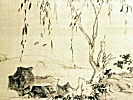

  
[Intangible Textual Heritage](../../index)  [Taoism](../index) 
[Index](index)  [Previous](mcm15)  [Next](mcm17) 

------------------------------------------------------------------------

[Buy this Book at
Amazon.com](https://www.amazon.com/exec/obidos/ASIN/0486419460/internetsacredte)

------------------------------------------------------------------------

[Buy this Book on
Kindle](https://www.amazon.com/exec/obidos/ASIN/B002KCO7KA/internetsacredte)

------------------------------------------------------------------------

  
*Musings of a Chinese Mystic*, by Lionel Giles, \[1906\], at Intangible
Textual Heritage

------------------------------------------------------------------------

p. 109

### PERSONAL ANECDOTES

Chuang Tzŭ was fishing in the P‘u when
the prince of Ch‘u sent two high officials to ask him to take charge of
the administration of the Ch‘u State.

Chuang Tzŭ went on fishing and, without turning his head, said "I have
heard that in Ch‘u there is a sacred tortoise which has been dead now
some three thousand years, and that the prince keeps this tortoise
carefully enclosed in a chest on the altar of his ancestral temple. Now
would this tortoise rather be dead and have its remains venerated, or be
alive and wagging its tail in the mud?"

"It would rather be alive," replied the two officials, "and wagging its
tail in the mud."

"Begone!" cried Chuang Tzŭ. "I too will wag my tail in the mud."

.        .        .        .        .

Hui Tzŭ was prime minister in the Liang State. Chuang Tzŭ went thither
to visit him.

Some one remarked: "Chuang Tzŭ has come. He wants to be minister in your
place,"

p. 110

Thereupon Hui Tzŭ was afraid, and searched all over the State for three
days and three nights to find him.

Then Chuang Tzŭ went to see Hui Tzŭ and said: "In the south there is a
bird. It is a kind of Do you know it? It started from the south sea to
fly to the north sea. Except on the *wu-t‘ung* tree, it would not
alight. It would eat nothing but the fruit of the bamboo, drink nothing
but the purest spring water. An owl which had got the rotten carcass of
a rat, looked up as the phoenix flew by, and screeched. Are you not
screeching at me over your kingdom of Liang?"

.        .        .        .        .

Chuang Tzŭ and Hui Tzŭ had strolled on to the bridge over the Hao, when
the former observed: "See how the minnows are darting about! That is the
pleasure of fishes."

"You not being a fish yourself," said Hui Tzŭ, "how can you possibly
know in what consists the pleasure of fishes?"

"And you not being I," retorted Chuang Tzŭ, "how can you know that I do
not know?"

"If I, not being you, cannot know what you know," urged Hui Tzŭ, "it
follows that you, not being a fish, cannot know in what consists the
pleasure of fishes."

"Let us go back," said Chuang Tzŭ, "to your

p. 111

original question. You asked me how I knew in what consists the pleasure
of fishes. Your very question shows that you knew I knew. [1](#fn_27) I knew it from my own feelings on this
bridge."

.        .        .        .        .

When Chuang Tzŭ's wife died, Hui Tzŭ went to condole. He found the
widower sitting on the ground, singing, with his legs spread out at a
right angle, and beating time on a bowl.

"To live with your wife," exclaimed Hui Tzŭ, "and see your eldest son
grow up to be a man, and then not to shed a tear over her corpse,—this
would be bad enough. But to drum on a bowl, and sing; surely this is
going too far."

"Not at all," replied Chuang Tzŭ. "When she died, I could not help being
affected by her death. Soon, however, I remembered that she had already
existed in a previous state before birth, without form, or even
substance; that while in that unconditioned condition, substance was
added to spirit; that this substance then assumed form; and that the
next stage was birth. And now, by virtue of a further change, she is
dead, passing from one phase to another like the sequence of spring,
summer, autumn and winter. And while she is thus lying asleep in
Eternity, for me to go about weeping and wailing

p. 112

would be to proclaim myself ignorant of these natural laws. Therefore I
refrain."

.        .        .        .        .

When Chuang Tzŭ was about to die, his disciples expressed a wish to give
him a splendid funeral. But Chuang Tzŭ said: "With Heaven and Earth for
my coffin and shell; with the sun, moon, and stars, as my burial
regalia; and with all creation to escort me to the grave,—are not my
funeral paraphernalia ready to hand?"

"We fear," argued the disciples, "lest the carrion kite should eat the
body of our Master;" to which Chuang Tzŭ replied: "Above ground I shall
be food for kites; below I shall be food for mole-crickets and ants. Why
rob one to feed the other?"

\_\_\_\_\_\_\_\_\_\_\_\_\_\_\_\_\_\_\_\_\_\_\_  
*Printed by Hazell, Watson & Viney, Ld., London and
Aylesbury*.

------------------------------------------------------------------------

### Footnotes

[111:1](mcm16.htm#fr_27) For you asked me *how*
I knew.

------------------------------------------------------------------------

[Next: Advertisements](mcm17)
