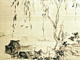
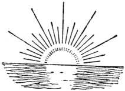

  
[Intangible Textual Heritage](../../index)  [Taoism](../index) 
[Index](index)  [Previous](mcm16) 

------------------------------------------------------------------------

[Buy this Book at
Amazon.com](https://www.amazon.com/exec/obidos/ASIN/0486419460/internetsacredte)

------------------------------------------------------------------------

[Buy this Book on
Kindle](https://www.amazon.com/exec/obidos/ASIN/B002KCO7KA/internetsacredte)

------------------------------------------------------------------------

  
*Musings of a Chinese Mystic*, by Lionel Giles, \[1906\], at Intangible
Textual Heritage

------------------------------------------------------------------------

------------------------------------------------------------------------

\[The following advertisements appeared at the end of the original
volume. They are included as documentation, not as an
advertisement.—JBH.\]

# THE WISDOM OF THE EAST SERIES

### Edited by CRANMER-BYNG and Dr. S. A. KAPADIA

 

##### THE SERIES AND ITS PURPOSE

The object of the Editors of this Series
is a very definite one. They desire above all things that, in their
humble way, these books shall be the ambassadors of good-will and
understanding between East and West—the old world of Thought and the new
of Action. In this endeavour, and in their own sphere, they are but
followers of the highest example in the land. They are confident that a
deeper knowledge of the great ideals and lofty philosophy of Oriental
thought may help to a revival of that true spirit of Charity which
neither despises nor fears the nations of another creed and colour.

\_\_\_\_\_\_\_\_\_\_\_\_\_\_

### *NEW VOLUMES*

#### *in the Press*

**TAOIST TEACHINGS**. From the Mystical Philosophy of Leih Tzŭ.
Translated by Lionel Giles, M.A. 2/- net.

\_\_\_\_\_\_\_\_\_\_\_\_\_\_

#### *INDIAN*

**THE HEART OF INDIA**. Sketches in the History of Hindu Religion and
Morals. By L. D. Barnett, M.A., Litt.D. Professor of Sanskrit at University
College, London. 2/- net.

**BRAHMA-KNOWLEDGE: An Outline of the Philosophy of the Vedānta**. As
set forth by the Upanishads and by Sankara. By L. D. Barnett, M.A., Litt.D. Professor of Sanskrit at University
College, London. 3/- net.

\[*Continued over*

------------------------------------------------------------------------

**THE PATH OF LIGHT**. Rendered for the first time into English from the
Bodhi-charyāvatāra of Śānti-Deva. A Manual of Mahā-Yanā Buddhism. By L.
D. Barnett, M.A., Litt.D. 2/- net.

**LEGENDS OF INDIAN BUDDHISM**. Translated from "L’Introduction à
l’Histoire du Buddhisme Indien" of Eugene Burnouf, with an Introduction
by Winifred Stephens. 2/- net.

**THE WAY OF THE BUDDHA**. Selections from the Buddhist texts, together
with the original Pali, with Introduction by Herbert Baynes, M.R.A.S. 2/- net.

#### *IRANIAN (Persian, Pelevi, Zend, etc.)*

**THE RUBÁ’IYÁT OF HÁFIZ**. Translated with Introduction by Syed Abdul Majid, LL.D. Rendered into English
Verse by L. Cranmer-Byng. 1/- net.

**THE SPLENDOUR OF GOD**. Being Extracts from the Sacred Writings of the
Bahais. With Introduction by Eric
Hammond. 2/- net.

**THE TEACHINGS OF ZOROASTER, and the Philosophy of the Parsi
Religion**. Translated with Introduction by Dr. S. A. Kapadia, Lecturer, University College,
London. 2/- net.

**THE PERSIAN MYSTICS**.

**I. Jalálu’d-din Rúmí**. By F. Hadland
Davis. 2/- net.

**II. Jám**í. By F. Hadland Davis. 2/-
net.

**THE BUSTĀN OF SA’DI**. From the Persian. Translated with Introduction
by A. Hart Edwards. 2/- net.

**SA’DI’S SCROLL OF WISDOM**. By Shaikh
Sa’di. With Introduction by Sir Arthur N.
Wollaston, K.C.I.E. /- net.  
    With Persian Script added. 2/- net.

**THE ROSE GARDEN OF SA’DI**. Selected and Rendered from the Persian
with Introduction by L. Cranmer-Byng. 1/-
net.

#### *ARABIC*

**THE ALCHEMY OF HAPPINESS**. By Al
Ghazzali. Rendered into English by Claud
Field. 2/- net.

 

 

 

 
