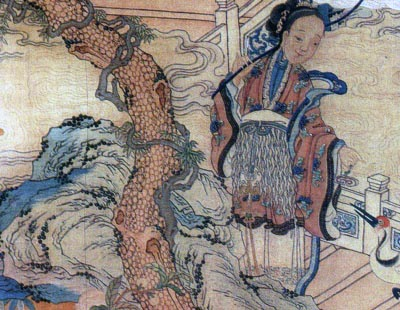

  
[Intangible Textual Heritage](../../index)  [Taoism](../index) 

------------------------------------------------------------------------

[Buy this Book at
Amazon.com](https://www.amazon.com/exec/obidos/ASIN/1428628649/internetsacredte)

------------------------------------------------------------------------

<table width="75%">
<colgroup>
<col style="width: 50%" />
<col style="width: 50%" />
</colgroup>
<tbody>
<tr class="odd">
<td width="50%" data-valign="TOP"> 
Ho Hsian Ku, a Taoist immortal</td>
<td width="50%" data-valign="CENTER"><h1 id="the-tao-teh-king-a-short-study-in-comparative-religion" data-align="CENTER">The Tao Teh King: A Short Study in Comparative Religion</h1>
<h2 id="by-c.-spurgeon-medhurst" data-align="CENTER">by C. Spurgeon Medhurst</h2>
<h4 id="section" data-align="CENTER">[1905]</h4></td>
</tr>
</tbody>
</table>

------------------------------------------------------------------------

[Contents](#contents)    [Start Reading](mt00)    [Page
Index](pageidx)    [Text \[Zipped\]](mt.txt.gz)

------------------------------------------------------------------------

|                                                                                                                           |
|---------------------------------------------------------------------------------------------------------------------------|
|  |

There are dozens, perhaps hundreds of translations of the Tao te Ching,
the root sacred text of Taoism, one of the three traditional religions
of China. This one, written by an ex-missionary who appears to have had
Theosophical leanings, includes extensive notes on similarities with
other religions, primarily Christianity, but also Buddhism and Hinduism.
This gives a new way of looking at this multi-faceted text, which has
always had appeal to mystics of all persuasions.

------------------------------------------------------------------------

 [Title Page](mt00)  
[Index](mt01)  
[Foreword](mt02)  
[Conclusion](mt03)  
[Chapter I](mt04)  
[Chapter II](mt05)  
[Chapter III](mt06)  
[Chapter IV](mt07)  
[Chapter V](mt08)  
[Chapter VI](mt09)  
[Chapter VII](mt10)  
[Chapter VIII](mt11)  
[Chapter IX](mt12)  
[Chapter X](mt13)  
[Chapter XI](mt14)  
[Chapter XII](mt15)  
[Chapter XIII](mt16)  
[Chapter XIV](mt17)  
[Chapter XV](mt18)  
[Chapter XVI](mt19)  
[Chapter XVII](mt20)  
[Chapter XVIII](mt21)  
[Chapter XIX](mt22)  
[Chapter XX](mt23)  
[Chapter XXI](mt24)  
[Chapter XXII](mt25)  
[Chapter XXIII](mt26)  
[Chapter XXIV](mt27)  
[Chapter XXV](mt28)  
[Chapter XXVI](mt29)  
[Chapter XXVII](mt30)  
[Chapter XXVIII](mt31)  
[Chapter XXIX](mt32)  
[Chapter XXX](mt33)  
[Chapter XXXI](mt34)  
[Chapter XXXII](mt35)  
[Chapter XXXIII](mt36)  
[Chapter XXXIV](mt37)  
[Chapter XXXV](mt38)  
[Chapter XXXVI](mt39)  
[Chapter XXXVII](mt40)  
[Chapter XXXVIII](mt41)  
[Chapter XXXIX](mt42)  
[Chapter XL](mt43)  
[Chapter XLI](mt44)  
[Chapter XLII](mt45)  
[Chapter XLIII](mt46)  
[Chapter XLIV](mt47)  
[Chapter XLV](mt48)  
[Chapter XLVI](mt49)  
[Chapter XLVII](mt50)  
[Chapter XLVIII](mt51)  
[Chapter XLIX](mt52)  
[Chapter L](mt53)  
[Chapter LI](mt54)  
[Chapter LII](mt55)  
[Chapter LIII](mt56)  
[Chapter LIV](mt57)  
[Chapter LV](mt58)  
[Chapter LVI](mt59)  
[Chapter LVII](mt60)  
[Chapter LVIII](mt61)  
[Chapter LIX](mt62)  
[Chapter LX](mt63)  
[Chapter LXI](mt64)  
[Chapter LXII](mt65)  
[Chapter LXIII](mt66)  
[Chapter XLIV](mt67)  
[Chapter LXV](mt68)  
[Chapter LXVI](mt69)  
[Chapter LXVII](mt70)  
[Chapter LXVIII](mt71)  
[Chapter LXIX](mt72)  
[Chapter LXX](mt73)  
[Chapter LXXI](mt74)  
[Chapter LXXII](mt75)  
[Chapter LXXIII](mt76)  
[Chapter LXXIV](mt77)  
[Chapter LXXV](mt78)  
[Chapter LXXVI](mt79)  
[Chapter LXXVII](mt80)  
[Chapter LXXVIII](mt81)  
[Chapter LXXIX](mt82)  
[Chapter LXXX](mt83)  
[Chapter LXXXI](mt84)  
[Bibliography](mt85)  
