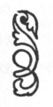
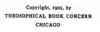

  
[Intangible Textual Heritage](../../index)  [Taoism](../index.md) 
[Index](index)  [Next](mt01.md) 

------------------------------------------------------------------------

[Buy this Book at
Amazon.com](https://www.amazon.com/exec/obidos/ASIN/1428628649/internetsacredte.md)

------------------------------------------------------------------------

  
*The Tao Teh King: A Short Study in Comparative Religion*, by C.
Spurgeon Medhurst, \[1905\], at Intangible Textual Heritage

------------------------------------------------------------------------

# THE TAO TEH KING

## A SHORT STUDY IN COMPARATIVE RELIGION

###### By

### C. SPURGEON MEDHURST

##### For Twenty Years a Missionary in China

 

#### CHICAGO

#### THEOSOPHICAL BOOK CONCERN

#### \[1905\]

Scanned, proofed and formatted by John Bruno Hare at Intangible Textual
Heritage, August 2008. This text is in the public domain in the US
because it was published prior to 1923.

  [  
Click to enlarge](img/title.jpg.md)  
Title Page  

 
[  
Click to enlarge](img/verso.jpg.md)  
Verso  

------------------------------------------------------------------------

[Next: Index](mt01.md)
