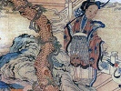

  
[Intangible Textual Heritage](../../index)  [Taoism](../index.md) 
[Index](index)  [Previous](mt56)  [Next](mt58.md) 

------------------------------------------------------------------------

[Buy this Book at
Amazon.com](https://www.amazon.com/exec/obidos/ASIN/1428628649/internetsacredte.md)

------------------------------------------------------------------------

  
*The Tao Teh King: A Short Study in Comparative Religion*, by C.
Spurgeon Medhurst, \[1905\], at Intangible Textual Heritage

------------------------------------------------------------------------

p. 92

### CHAPTER LIV.

Who plants well will not have his work uprooted; who embraces well will
not lose what he holds; the offerings of his sons and grandsons will
never end. [1](#fn_175.md)

Who thus regulates himself has virtue which is genuine; who thus
regulates his household has virtue which overflows; who thus regulates
his neighborhood has virtue which excels; who thus regulates the state
has virtue which abounds; who thus regulates the world has virtue [2](#fn_176.md) which is universal.

Therefore let every man prove himself; let each household, neighborhood,
and state do the same; let the world also follow the same course.

How do I know that it must be thus with the world? By this same (which
has been just said).

"The kingdom of God is within you." "Every plant which my heavenly
Father planted not, shall be rooted up." "Let not your heart be
troubled: ye believe in God, believe also in me. In my Father's house
are many abiding places."

This was the teaching, and the daily experience of the Lord Jesus.
Whoever roots his life on these levels will not only be never swept from
off his feet but will become a regulative force, which will not cease at
the stage called death. The offerings of his sons and grandsons will
never end.

------------------------------------------------------------------------

### Footnotes

[92:1](mt57.htm#fr_175.md) ''Where is that which
is so planted that it cannot be uprooted, or so held that it cannot be
torn away? Only the Sage knows the truth of spirit and the illusion of
matter, so that he can give up the latter for the sake of the former.
His virtue overflows, but indeed he establishes nothing, so that what he
establishes cannot be uprooted. Truly he grasps nothing, and so what he
embraces cannot be taken from him. Will not his sons and his grandsons
be able therefore to continue their sacrifices without
ceasing?"—*Su-cheh*.

[92:2](mt57.htm#fr_176) "Virtue" (*teh*.md) is the
same Chinese word as that translated "energy" in chaps.
[38](mt41.htm#an_ch_38), [61](mt64.htm#an_ch_61.md),
[55](mt58.htm#an_ch_55.md), etc. See Index.

------------------------------------------------------------------------

[Next: Chapter LV](mt58.md)
