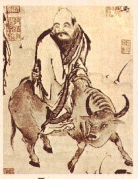

  
[Intangible Textual Heritage](../../index)  [Taoism](../index) 

------------------------------------------------------------------------

[Buy this Book on
Kindle](https://www.amazon.com/exec/obidos/ASIN/B002I6314Q/internetsacredte)

------------------------------------------------------------------------

<table width="75%">
<colgroup>
<col style="width: 50%" />
<col style="width: 50%" />
</colgroup>
<tbody>
<tr class="odd">
<td width="50%" data-valign="TOP"> 
Laotzu [Public Domain Image]</td>
<td width="50%" data-valign="CENTER"><h1 id="the-sayings-of-lao-tzu" data-align="CENTER">The Sayings of Lao Tzu</h1>
<h2 id="by-lionel-giles" data-align="CENTER">by Lionel Giles</h2>
<h4 id="section" data-align="CENTER">[1905]</h4></td>
</tr>
</tbody>
</table>

------------------------------------------------------------------------

[Contents](#contents)    [Start Reading](salt00)    [Page
Index](pageidx)    [Text \[Zipped\]](salt.txt.gz)

|                                                                                                                           |
|---------------------------------------------------------------------------------------------------------------------------|
|  |

------------------------------------------------------------------------

This is Lionel Giles' translation of the Tao te Ching, from the [Wisdom
of the East](../../woe/index) series. Giles (1875-1958) was Keeper of
the Department of Oriental Books and Manuscripts at the British Museum.
He also translated Sun Tzu's [Art of War](../aow/index).

This translation is long out of print, which is a shame, because it is a
very clear English rendition of this very difficult and profund text.

------------------------------------------------------------------------

 [Title Page](salt00)  
[Contents](salt01)  
[Editorial Note](salt02)  
[Introduction](salt03)  
[Tao In Its Transcendental Aspect, And In Its Physical
Manifestation](salt04)  
[Tao As A Moral Principle, Or ''Virtue''](salt05)  
[The Doctrine of Inaction](salt06)  
[Lowliness And Humility](salt07)  
[Government](salt08)  
[War](salt09)  
[Paradoxes](salt10)  
[Miscellaneous Sayings and Precepts](salt11)  
[Lao Tzŭ On Himself](salt12)  
