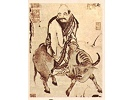

  
[Intangible Textual Heritage](../../index)  [Taoism](../index) 
[Index](index)  [Previous](salt01)  [Next](salt03) 

------------------------------------------------------------------------

[Buy this Book on
Kindle](https://www.amazon.com/exec/obidos/ASIN/B002I6314Q/internetsacredte)

------------------------------------------------------------------------

  
*The Sayings of Lao-Tzu*, Lionel Giles translation \[1905\], at
Intangible Textual Heritage

------------------------------------------------------------------------

p. 8

### EDITORIAL NOTE

THE object of the Editors of this series is a very definite one. They
desire above all things that, in their humble way, these books shall be
the ambassadors of good-will and understanding between East and
West--the old world of Thought and the new of Action. In this endeavour,
and in their own sphere, they are but followers of the highest example
in the land. They are confident that a deeper knowledge of the great
ideals and lofty philosophy of Oriental thought may help to a revival of
that true spirit of Charity which neither despises nor fears the nation
of another creed and colour.

L. CRANMER-BYNG.  
S. A. KAPADIA.

NORTHBROOK SOCIETY,  
   21, CROMWELL ROAD,  
      KENSINGTON, S.W.

------------------------------------------------------------------------

[Next: Introduction](salt03)
