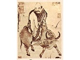

  
[Intangible Textual Heritage](../../index)  [Taoism](../index) 
[Index](index)  [Previous](salt11) 

------------------------------------------------------------------------

[Buy this Book on
Kindle](https://www.amazon.com/exec/obidos/ASIN/B002I6314Q/internetsacredte)

------------------------------------------------------------------------

  
*The Sayings of Lao-Tzu*, Lionel Giles translation \[1905\], at
Intangible Textual Heritage

------------------------------------------------------------------------

p. 54

### LAO TZŬ ON HIMSELF

ALAS! the barrenness of the age has not yet reached its limit. All men
are radiant with happiness, as if enjoying a great feast, as if mounted
on a tower in spring. I alone am still, and give as yet no sign of joy.
I am like an infant which has not yet smiled, forlorn as one who has
nowhere to lay his head. Other men have plenty, while I alone seem to
have lost all. I am a man foolish in heart, dull and confused. Other men
are full of light; I alone seem to be in darkness. Other men are alert;
I alone am listless. I am unsettled as the ocean, drifting as though I
had no stopping-place. All men have their usefulness; I alone am stupid
and clownish. Lonely though I am and unlike other men, yet I revere the
Foster-Mother, Tao.

My words are very easy to understand, very easy to put into practice;
yet the world can neither understand nor practise them.

My words have a clue, my actions have an underlying principle. It is
because men do not know the clue that they understand me not.

Those who know me are but few, and on that account my honour is the
greater.

Thus the Sage wears coarse garments, but carries a jewel in his bosom.

 

THE END

 

 

 
