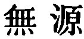
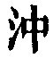
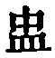

  
[Intangible Textual Heritage](../../index)  [Taoism](../index.md) 
[Index](index)  [Previous](sbe39010)  [Next](sbe39012.md) 

------------------------------------------------------------------------

### 4.

4\. 1. The Tâo is (like) the emptiness of a vessel; and in our
employment of it we must be on our guard against all fulness. How deep
and unfathomable

p. 50

it is, as if it were the Honoured Ancestor of all things!

2\. We should blunt our sharp points, and unravel the complications of
things; we should attemper our brightness, and bring ourselves into
agreement with the obscurity of others. How pure and still the Tâo is,
as if it would ever so continue!

3\. I do not know whose son it is. It might appear to have been before
God.

 , 'The Fountainless.'
There is nothing before the Tâo; it might seem to have been before God.
And yet there is no demonstration by it of its presence and operation.
It is like the emptiness of a vessel. The second character =   = 
;--see Khang-hsî on the latter. The practical lesson
is, that in following the Tâo we must try to be like it.

------------------------------------------------------------------------

[Next: Chapter 5](sbe39012.md)
