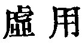

  
[Intangible Textual Heritage](../../index)  [Taoism](../index) 
[Index](index)  [Previous](sbe39011)  [Next](sbe39013) 

------------------------------------------------------------------------

### 5.

5\. 1. Heaven and earth do not act from (the impulse of) any wish to be
benevolent; they deal with all things as the dogs of grass are dealt
with. The sages do not act from (any wish to be) benevolent; they deal
with the people as the dogs of grass are dealt with.

2\. May not the space between heaven and earth be compared to a bellows?

'Tis emptied, yet it loses not its power;  
'Tis moved again, and sends forth air the more.  
Much speech to swift exhaustion lead we see;  
Your inner being guard, and keep it free.

 , 'The Use of Emptiness.'
Quiet and unceasing is the operation of the Tâo, and effective is the
rule of the sage in accordance with it.

The grass-dogs in par. 1 were made of straw tied up in the shape of
dogs, and used in praying for rain; and afterwards,

p. 51

when the sacrifice was over, were thrown aside and left uncared for.
Heaven and earth and the sages dealt so with all things and with the
people; but the illustration does not seem a happy one. Both Kwang-dze
and Hwâi-nan mention the grass-dogs. See especially the former, XIV, 25
a, b. In that Book there is fully developed the meaning of this chapter.
The illustration in par. 2 is better. The Chinese bellows is different
to look at from ours, but the principle is the same in the construction
of both. The par. concludes in a way that lends some countenance to the
later Tâoism's dealing with the breath.

------------------------------------------------------------------------

[Next: Chapter 6](sbe39013)
