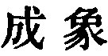
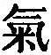

  
[Intangible Textual Heritage](../../index)  [Taoism](../index.md) 
[Index](index)  [Previous](sbe39012)  [Next](sbe39014.md) 

------------------------------------------------------------------------

### 6.

6\. The valley spirit dies not, aye the same;  
The female mystery thus do we name.  
Its gate, from which at first they issued forth,  
Is called the root from which grew heaven and earth.  
Long and unbroken does its power remain,  
Used gently, and without the touch of pain.

 , 'The Completion of
Material Forms.' This title rightly expresses the import of this
enigmatical chapter; but there is a foundation laid in it for the
development of the later Tâoism, which occupies itself with the
prolongation of life by the management of the breath ( ) or vital force.

'The valley' is used metaphorically as a symbol of 'emptiness' or
'vacancy;' and 'the spirit of the valley' is the something invisible,
yet almost personal, belonging to the Tâo, which constitutes the Teh
( ) in the name of our
King. 'The spirit of the valley' has come to be a name for the activity
of the Tâo in all the realm of its operation. 'The female mystery' is
the Tâo with a name of chapter 1, which is 'the Mother of all things.'
All living beings have a father and mother. The processes of generation
and production can hardly be imaged by us but by a recognition of this
fact; and so Lâo-dze thought of the existing realm of nature--of
life--as coming through an

p. 52

evolution (not a creation) from the primal air or breath, dividing into
two, and thence appearing in the forms of things, material and
immaterial. The chapter is found in Lieh-dze (I, 1 b) quoted by him from
a book of Hwang-Tî; and here Lâo-dze has appropriated it, and made it
his own. See the Introduction, [p. 2](sbe39003.htm#page_2.md).

------------------------------------------------------------------------

[Next: Chapter 7](sbe39014.md)
