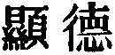
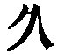

  
[Intangible Textual Heritage](../../index)  [Taoism](../index) 
[Index](index)  [Previous](sbe39021)  [Next](sbe39023) 

------------------------------------------------------------------------

### 15.

15\. 1. The skilful masters (of the Tâo) in old times, with a subtle and
exquisite penetration, comprehended its mysteries, and were deep (also)
so as to elude men's knowledge. As they were thus beyond men's
knowledge, I will make an effort to describe of what sort they appeared
to be.

2\. Shrinking looked they like those who wade through a stream in
winter; irresolute like those who are afraid of all around them; grave
like a guest (in awe of his host); evanescent like ice that is melting
away; unpretentious like wood that has not been fashioned into anything;
vacant like a valley, and dull like muddy water.

3\. Who can (make) the muddy water (clear)? Let it be still, and it will
gradually become clear. Who can secure the condition of rest? Let
movement go on, and the condition of rest will gradually arise.

4\. They who preserve this method of the Tâo do not wish to be full (of
themselves). It is through their not being full of themselves that they
can

p. 59

afford to seem worn and not appear new and complete.

 , 'The Exhibition of the
Quality,' that is, of the Tâo, which has been set forth in the preceding
chapter. Its practical outcome is here described in the masters of it of
old, who in their own weakness were yet strong in it, and in their
humility were mighty to be co-workers with it for the good of the world.

The variety of the readings in par. 4 is considerable, but not so as to
affect the meaning. This par. is found in Hwâi-nan (XII, 23 a) with an
unimportant variation. From the illustration to which it is subjoined he
understood the fulness, evidently as in ch. 9, as being that of a vessel
filled to overflowing. Both here and there such fulness is used
metaphorically of a man overfull of himself; and then Lâo-dze slides
into another metaphor, that of a worn-out garment. The text of par. 3
has been variously tampered with. I omit the   of the current copies, after
the example of the editors of the great recension of the Yung-lo period
(A. D. 1403-1424) of the Ming dynasty.}

------------------------------------------------------------------------

[Next: Chapter 16](sbe39023)
