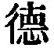
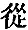

  
[Intangible Textual Heritage](../../index)  [Taoism](../index.md) 
[Index](index)  [Previous](sbe39027)  [Next](sbe39029.md) 

------------------------------------------------------------------------

### 21.

21\. The grandest forms of active force  
From Tâo come, their only source.  
Who can of Tâo the nature tell?  
Our sight it flies, our touch as well.  
Eluding sight, eluding touch,  
The forms of things all in it crouch;  
Eluding touch, eluding sight,  
There are their semblances, all right.  
Profound it is, dark and obscure;  
Things' essences all there endure.  
Those essences the truth enfold  
Of what, when seen, shall then be told.  
Now it is so; 'twas so of old.  
Its name--what passes not away;  
So, in their beautiful array,  
Things form and never know decay.

How know I that it is so with all the beauties of existing things? By
this (nature of the Tâo).

 , 'The Empty Heart.' But
I fail to see the applicability of the title. The subject of the chapter
is the Tâo in its operation. This is the significance of the   in the first clause or line,
and to render it by 'virtue,' as Julien and Chalmers do, only serves to
hide the meaning. Julien, however, says that 'the virtue is that of the
Tâo; and he is right in taking 
, the last character of the second line, as having the
sense of 'from,' 'the source from,' and not, as Chalmers does, in the
sense of 'following.'

Lâo-dze's mind is occupied with a very difficult subject to describe the
production of material forms by the Tâo; how or from what, he does not
say. What I have rendered 'semblances,' Julien 'les images,' and
Chalmers 'forms,' seems,

p. 65

as the latter says, in some way to correspond to the 'Eternal Ideas' of
Plato in the Divine Mind. But Lâo-dze had no idea of 'personality' in
the Tâo.

------------------------------------------------------------------------

[Next: Chapter 22](sbe39029.md)
