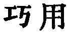

  
[Intangible Textual Heritage](../../index)  [Taoism](../index.md) 
[Index](index)  [Previous](sbe39033)  [Next](sbe39035.md) 

------------------------------------------------------------------------

p. 70

### 27.

27\. 1. The skilful traveller leaves no traces of his wheels or
footsteps; the skilful speaker says nothing that can be found fault with
or blamed; the skilful reckoner uses no tallies; the skilful closer
needs no bolts or bars, while to open what he has shut will be
impossible; the skilful binder uses no strings or knots, while to
unloose what he has bound will be impossible. In the same way the sage
is always skilful at saving men, and so he does not cast away any man;
he is always skilful at saving things, and so he does not cast away
anything. This is called 'Hiding the light of his procedure.'

2\. Therefore the man of skill is a master (to be looked up to) by him
who has not the skill; and he who has not the skill is the helper of
(the reputation of) him who has the skill. If the one did not honour his
master, and the other did not rejoice in his helper, an (observer),
though intelligent, might greatly err about them. This is called 'The
utmost degree of mystery.'

 , 'Dexterity in Using,'
that is, in the application of the Tâo. This is the substance of the
chapter, celebrating the effective but invisible operation of the Tâo,
and the impartial exercise of it for the benefit of all men and all
things.

I have given the most natural construction of the two characters at the
end of par. 1, the only possible construction of them, so far as I can
see, suitable to the context. The action of the Tâo (non-acting and yet
all-efficient) and that of the sage in accordance with it, are veiled by
their nature from the sight of ordinary men.

It is more difficult to catch the scope and point of par. 2. If there
were not the conditions described in it, it would be hard for even an
intelligent onlooker to distinguish between the man who had the skill
and the man without it, between

p. 71

him who possessed the Tâo, and him who had it not, which would be
strange indeed.}

------------------------------------------------------------------------

[Next: Chapter 28](sbe39035.md)
