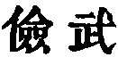
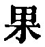
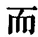
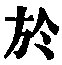

  
[Intangible Textual Heritage](../../index)  [Taoism](../index.md) 
[Index](index)  [Previous](sbe39036)  [Next](sbe39038.md) 

------------------------------------------------------------------------

### 30.

30\. 1. He who would assist a lord of men in harmony with the Tâo will
not assert his mastery in the kingdom by force of arms. Such a course is
sure to meet with its proper return.

2\. Wherever a host is stationed, briars and thorns spring up. In the
sequence of great armies there are sure to be bad years.

p. 73

3\. A skilful (commander) strikes a decisive blow, and stops. He does
not dare (by continuing his operations) to assert and complete his
mastery. He will strike the blow, but will be on his guard against being
vain or boastful or arrogant in consequence of it. He strikes it as a
matter of necessity; he strikes it, but not from a wish for mastery.

4\. When things have attained their strong maturity they become old.
This may be said to be not in accordance with the Tâo: and what is not
in accordance with it soon comes to an end.

 , 'A Caveat against War.'
War is contrary to the spirit of the Tâo, and, as being so, is
productive of misery, and leads to early ruin. It is only permissible in
a case of necessity, and even then its spirit and tendencies must be
guarded against.

In translating   by
'striking a decisive blow,' I have, no doubt, followed Julien's 'frapper
un coup décisif.' The same; 
 occurs six times in par. 3, followed by  , and Ziâo Hung says that in
all but the first instance the 
 should be taken as equivalent to  , so that we should have to
translate, 'He is determined against being vain,' &c. But there is no
necessity for such a construction of 
.

'Weakness' and not 'strength' is the character of the Tâo; hence the
lesson in par. 4.

------------------------------------------------------------------------

[Next: Chapter 31](sbe39038.md)
