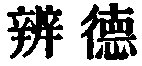

  
[Intangible Textual Heritage](../../index)  [Taoism](../index.md) 
[Index](index)  [Previous](sbe39039)  [Next](sbe39041.md) 

------------------------------------------------------------------------

### 33.

33\. 1. He who knows other men is discerning; he who knows himself is
intelligent. He who overcomes others is strong; he who overcomes himself
is mighty. He who is satisfied with his lot is rich; he who goes on
acting with energy has a (firm) will.

2\. He who does not fail in the requirements of his position, continues
long; he who dies and yet does not perish, has longevity.

 , 'Discriminating between
(different) Attributes.' The teaching of the chapter is that the
possession of the

p. 76

\[paragraph continues\] Tâo confers the various attributes which are.
here most distinguished. It has been objected to it that elsewhere the
Tâo is represented as associated with dulness and not intelligence, and
with weakness and not with strength. But these seem to be qualities
viewed from without, and acting on what is beyond itself. Inwardly, its
qualities are the very opposite, and its action has the effect of
enlightening what is dark, and overcoming what is strong.

More interesting are the predicates in par. 2. Ziâo Hung gives the
comment on it of the Indian monk, Kumâragîva, 'one of the four suns of
Buddhism, and who went to China in A.D. 401: 'To be alive and yet not
alive may well be called long; to die and yet not be dead may well be
called longevity.' He also gives the views of Lû Näng-shih (A.D.
1042-1102) that the freedom from change of Lieh-dze, from death of
Kwang-dze, and from extinction of the Buddhists, have all the same
meaning as the concluding saying of Lâo-dze here; that the human body is
like the covering of the caterpillar or the skin of the snake; that we
occupy it but for a passing sojourn. No doubt, Lâo-dze believed in
another life for the individual after the present. Many passages in
Kwang-dze indicate the same faith.

------------------------------------------------------------------------

[Next: Chapter 34](sbe39041.md)
