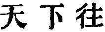

  
[Intangible Textual Heritage](../../index)  [Taoism](../index.md) 
[Index](index)  [Previous](sbe39041)  [Next](sbe39043.md) 

------------------------------------------------------------------------

### 35.

35\. 1. To him who holds in his hands the Great Image (of the invisible
Tâo), the whole world repairs. Men resort to him, and receive no hurt,
but (find) rest, peace, and the feeling of ease.

2\. Music and dainties will make the passing guest stop (for a time).
But though the Tâo as it comes from the mouth, seems insipid and has no
flavour, though it seems not worth being looked at or listened to, the
use of it is inexhaustible.

  'The Attribute of
Benevolence.' But there seems little appropriateness in this title. The
subject of the chapter is the inexhaustible efficacy of the Tâo for the
good of the world.

The Great Image (of the invisible Tâo) is a name for the Tâo, in its
operation; as in chapters 14 and 41. He who embodies this in his
government will be a centre of attraction for all the world. Or the
  may be taken as a
predicate of the holder of the Great Image:--'If he go all under heaven
teaching the Tâo.' Both constructions are maintained by commentators of
note. In par. 2 the attraction of the Tâo is contrasted with that of
ordinary pleasures and gratifications.

------------------------------------------------------------------------

[Next: Chapter 36](sbe39043.md)
