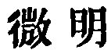
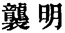

  
[Intangible Textual Heritage](../../index)  [Taoism](../index.md) 
[Index](index)  [Previous](sbe39042)  [Next](sbe39044.md) 

------------------------------------------------------------------------

p. 78

### 36.

36\. 1. When one is about to take an inspiration, he is sure to make a
(previous) expiration; when he is going to weaken another, he will first
strengthen him; when he is going to overthrow another, he will first
have raised him up; when he is going to despoil another, he will first
have made gifts to him:--this is called 'Hiding the light (of his
procedure).'

2\. The soft overcomes the hard; and the weak the strong.

3\. Fishes should not be taken from the deep; instruments for the profit
of a state should not be shown to the people.

 , 'Minimising the Light;'
equivalent, as Wû Khäng has pointed out, to the   of ch. 27.

The gist of the chapter is to be sought in the second paragraph, where
we have two instances of the action of the Tâo by contraries, supposed
always to be for good.

But there is a difficulty in seeing the applicability to this of the
cases mentioned in par. 1. The first case, indeed, is merely a natural
phenomenon, having no moral character; but the others, as they have been
illustrated from historical incidents, by Han Fei and others at least,
belong to schemes of selfish and unprincipled ambitious strategy, which
it would be injurious to Lâo-dze to suppose that he intended.

Par. 3 is the most frequently quoted of all the passages in our King,
unless it be the first part of ch. 1. Fishes taken from the deep, and
brought into shallow water, can be easily taken or killed; that is plain
enough. 'The sharp instruments of a state' are not its 'weapons of war,'
nor its treasures,' nor its 'instruments of government,' that is, its
rewards and punishments, though this last is the interpretation often
put on them, and sustained by a foolish reference to an incident, real
or coined, in the history of the dukedom of Sung. The lî khî are
'contrivances for gain,' machines, and other methods to increase the
wealth of a state, but, according to the principles of Lâo-dze, really
injurious to it. These should not be shown to the people,

p. 79

whom the Tâoistic system would keep in a state of primitive simplicity
and ignorance. This interpretation is in accordance with the meaning of
the characters, and with the general teaching of Tâoism. In no other way
can I explain the paragraph so as to justify the place undoubtedly
belonging to it in the system.

------------------------------------------------------------------------

[Next: Chapter 37](sbe39044.md)
