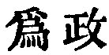
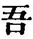

  
[Intangible Textual Heritage](../../index)  [Taoism](../index.md) 
[Index](index)  [Previous](sbe39043)  [Next](sbe39045.md) 

------------------------------------------------------------------------

### 37.

37\. 1. The Tâo in its regular course does nothing (for the sake of
doing it), and so there is nothing which it does not do.

2\. If princes and kings were able to maintain it, all things would of
themselves be transformed by them.

3\. If this transformation became to me an object of desire, I would
express the desire by the nameless simplicity.

Simplicity without a name  
Is free from all external aim.  
With no desire, at rest and still,  
All things go right as of their will.

 , 'The Exercise of
Government.' This exercise should be according to the Tâo, doing without
doing, governing without government.

The subject of the third paragraph is a feudal prince or the king, and
he is spoken of in the first person, to give more vividness to the
style, unless the  , 'I,'
may, possibly, be understood of Lâo-dze himself personating one of them.

------------------------------------------------------------------------

[Next: Chapter 38](sbe39045.md)
