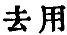

  
[Intangible Textual Heritage](../../index)  [Taoism](../index.md) 
[Index](index)  [Previous](sbe39046)  [Next](sbe39048.md) 

------------------------------------------------------------------------

### 40.

40\. 1. The movement of the Tâo  
By contraries proceeds;  
And weakness marks the course  
Of Tâo's mighty deeds.

p. 84

2\. All things under heaven sprang from It as existing (and named); that
existence sprang from It as non-existent (and not named).

 , 'Dispensing with the
Use (of Means);'--with their use, that is, as it appears to us. The
subject of the brief chapter is the action of the Tâo by contraries,
leading to a result the opposite of what existed previously, and by
means which might seem calculated to produce a contrary result.

In translating par. 2 1 have followed Ziâo Hung, who finds the key to it
in ch. 1. Having a name, the Tâo is 'the Mother of all things;' having
no name, it is 'the Originator of Heaven and Earth.' But here is the
teaching of Lâo-dze:--'If Tâo seems to be before God,' Tâo itself sprang
from nothing.

------------------------------------------------------------------------

[Next: Chapter 41](sbe39048.md)
