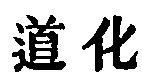
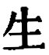
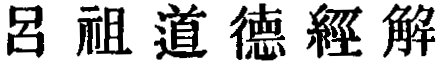
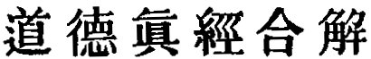
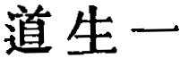
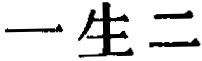
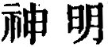

  
[Intangible Textual Heritage](../../index)  [Taoism](../index.md) 
[Index](index)  [Previous](sbe39048)  [Next](sbe39050.md) 

------------------------------------------------------------------------

### 42.

42\. 1. The Tâo produced One; One produced Two; Two produced Three;
Three produced All things. All things leave behind them the Obscurity
(out of which they have come), and go forward to embrace the Brightness
(into which they have emerged), while they are harmonised by the Breath
of Vacancy.

2\. What men dislike is to be orphans, to have little virtue, to be as
carriages without naves; and yet these are the designations which kings
and princes use for themselves. So it is that some things are increased
by being diminished, and others are diminished by being increased.

3\. What other men (thus) teach, I also teach. The violent and strong do
not die their natural death. I will make this the basis of my teaching.

 , 'The Transformations of
the Tâo.' In par. 2 we

p. 86

have the case of the depreciating epithets given to themselves by kings
and princes, which we found before in ch. 39, and a similar lesson is
drawn from it. Such depreciation leads to exaltation, and the contrary
course of self-exaltation leads to abasement. This latter case is stated
emphatically in par. 3, and Lâo-dze says that it was the basis of his
teaching. So far therefore we have in this chapter a repetition of the
lesson that the movement of the Tâo is by contraries,' and that its
weakness is the sure precursor of strength. But the connexion between
this lesson and what he says in par. 1 it is difficult to trace. Up to
this time at least it has baffled myself. The passage seems to give us a
cosmogony. 'The Tâo produced One.' We have already seen that the Tâo is
'The One.' Are we to understand here that the Tâo, and the One were one
and the same? In this case what would be the significance of the   ('produced')?--that the Tâo
which had been previously 'non-existent' now became 'existent,' or
capable of being named? This seems to be the view of Sze-mâ Kwang (A.D.
1009-1086).

The most singular form which this view assumes is in one of the
treatises on our King, attributed to the Tâoist patriarch Lü ( ), that 'the One is Heaven,
which was formed by the congealing of the Tâo.' According to another
treatise, also assigned to the same Lü (
) the One was 'the primordial ether;' the Two, 'the
separation of that into its Yin and Yang constituents;' and the Three,
'the production of heaven, earth, and man by these.' In quoting the
paragraph Hwâi-nan dze omits 
, and commences with 
, and his glossarist, Kâo Yû, makes out the One to be
the Tâo, the Two to be Spiritual Intelligences ( ), and the Three to be the
Harmonising Breath. From the mention of the Yin and Yang that follows, I
believe that Lâo-dze intended by the Two these two qualities or elements
in the primordial ether, which would be 'the One.' I dare not hazard a
guess as to what 'the Three' were.

------------------------------------------------------------------------

[Next: Chapter 43](sbe39050.md)
