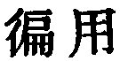
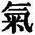

  
[Intangible Textual Heritage](../../index)  [Taoism](../index.md) 
[Index](index)  [Previous](sbe39049)  [Next](sbe39051.md) 

------------------------------------------------------------------------

p. 87

### 43.

43\. 1. The softest thing in the world dashes against and overcomes the
hardest; that which has no (substantial) existence enters where there is
no crevice. I know hereby what advantage belongs to doing nothing (with
a purpose).

2\. There are few in the world who attain to the teaching without words,
and the advantage arising from non-action.

 , 'The Universal Use (of
the action in weakness of the Tâo).' The chapter takes us back to the
lines of ch. 40, that

'Weakness marks the course  
Of Tâo's mighty deeds.'

By 'the softest thing in the world' it is agreed that we are to
understand 'water,' which will wear away the hardest rocks. 'Dashing
against and overcoming' is a metaphor taken from hunting. Ho-shang Kung
says that 'what has no existence' is the Tâo; it is better to understand
by it the unsubstantial air (
) which penetrates everywhere, we cannot see how.

Compare par. 2 with ch. 2, par. 3.

------------------------------------------------------------------------

[Next: Chapter 44](sbe39051.md)
