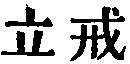

  
[Intangible Textual Heritage](../../index)  [Taoism](../index.md) 
[Index](index)  [Previous](sbe39050)  [Next](sbe39052.md) 

------------------------------------------------------------------------

### 44.

44\. 1. Or fame or life,  
    Which do you hold more dear?  
Or life or wealth,  
    To which would you adhere?  
Keep life and lose those other things;  
Keep them and lose your life:--which brings  
    Sorrow and pain more near?

2\. Thus we may see,  
    Who cleaves to fame  
    Rejects what is more great;  
Who loves large stores  
    Gives up the richer state.

p. 88

3\. Who is content  
Needs fear no shame.  
Who knows to stop  
Incurs no blame.  
From danger free  
Long live shall he.

 , 'Cautions.' The chapter
warns men to let nothing come into competition with the value which they
set on the Tâo. The Tâo is not named, indeed, but the idea of it was
evidently in the writer's mind.

The whole chapter rhymes after a somewhat peculiar fashion; familiar
enough, however, to one who is acquainted with the old rhymes of the
Book of Poetry.

------------------------------------------------------------------------

[Next: Chapter 45](sbe39052.md)
