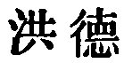

  
[Intangible Textual Heritage](../../index)  [Taoism](../index) 
[Index](index)  [Previous](sbe39051)  [Next](sbe39053) 

------------------------------------------------------------------------

### 45.

45\. 1. Who thinks his great achievements poor  
Shall find his vigour long endure.  
Of greatest fulness, deemed a void,  
Exhaustion ne'er shall stem the tide.  
Do thou what's straight still crooked deem;  
Thy greatest art still stupid seem,  
And eloquence a stammering scream.

2\. Constant action overcomes cold; being still overcomes heat. Purity
and stillness give the correct law to all under heaven.

 , 'Great or Overflowing
Virtue.' The chapter is another illustration of the working of the Tâo
by contraries. According to Wû Khäng, the action which overcomes cold is
that of the Yang element in the developing primordial ether; and the
stillness which overcomes heat is that of the contrary Yin element.
These may have been in Lâo-dze's mind, but the statements are so simple
as hardly to need any comment. Wû further says that the purity and
stillness are descriptive of the condition of non-action.

------------------------------------------------------------------------

[Next: Chapter 46](sbe39053)
