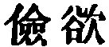
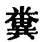
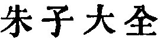
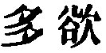
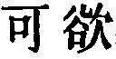

  
[Intangible Textual Heritage](../../index)  [Taoism](../index.md) 
[Index](index)  [Previous](sbe39052)  [Next](sbe39054.md) 

------------------------------------------------------------------------

### 46.

46\. 1. When the Tâo prevails in the world, they send back their swift
horses to (draw) the dung-carts.

p. 89

When the Tâo is disregarded in the world, the war-horses breed in the
border lands.

2\. There is no guilt greater than to sanction ambition; no calamity
greater than to be discontented with one's lot; no fault greater than
the wish to be getting. Therefore the sufficiency of contentment is an
enduring and unchanging sufficiency.

 , 'The Moderating of
Desire or Ambition.' The chapter shows how the practice of the Tâo must
conduce to contentment and happiness.

In translating par. 1 I have, after Wû Khäng, admitted a   after the  , his chief authority for doing
so being that it is so found in a poetical piece by Kang Häng (A. D.
78-139). Kû Hsî also adopted this reading (
, XVIII, 7 a). In par. 2 Han Ying has a tempting
variation of   for  , but I have not adopted it
because the same phrase occurs elsewhere.

------------------------------------------------------------------------

[Next: Chapter 47](sbe39054.md)
