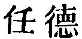
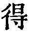
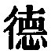

  
[Intangible Textual Heritage](../../index)  [Taoism](../index.md) 
[Index](index)  [Previous](sbe39055)  [Next](sbe39057.md) 

------------------------------------------------------------------------

### 49.

49\. 1. The sage has no invariable mind of his own; he makes the mind of
the people his mind.

2\. To those who are good (to me), I am good; and to those who are not
good (to me), I am also good;--and thus (all) get to be good. To those
who are sincere (with me), I am sincere; and to those who are not
sincere (with me), I am also sincere;--and thus (all) get to be sincere.

3\. The sage has in the world an appearance of indecision, and keeps his
mind in a state of indifference to all. The people all keep their eyes
and ears directed to him, and he deals with them all as his children.

 , 'The Quality of
Indulgence.' The chapter shows how that quality enters largely into the
dealing of the sage with other men, and exercises over them a
transforming influence, dominated as it is in him by the Tâo.

My version of par. 1 is taken from Dr. Chalmers. A good commentary on it
was given by the last emperor but one of the earlier of the two great
Sung dynasties, in the period A. D. 1111-1117:--'The mind of the sage is
free from preoccupation and able to receive; still, and able to
respond.'

In par. 2 I adopt the reading of to get 
 ('to get') instead of

p. 92

the more common  
('virtue' or 'quality'). There is a passage in Han Ying (IX, 3 b, 4 a),
the style of which, most readers will probably agree with me in
thinking, was moulded on the text before us, though nothing is said of
any connexion between it and the saying of Lâo-dze. I must regard it as
a sequel to the conversation between Confucius and some of his disciples
about the principle (Lâo's principle) that 'Injury should be recompensed
with Kindness,' as recorded in the Con. Ana., XIV, 36. We read:--'Dze-lû
said, "When men are good to me, I will also be good to them; when they
are not good to me, I will also be not good to them." Dze-kung said,
"When men are good to me, I will also be good to them; when they are not
good to me, I will simply lead them on, forwards it may be or
backwards." Yen Hui said, When men are good to me, I will also be good
to them when they are not good to me, I will still be good to them." The
views of the three disciples being thus different, they referred the
point to the Master, who said, "The words of Dze-lû are such as might be
expected among the (wild tribes of) the Man and the Mo; those of
Dze-kung, such as might be expected among friends; those of Hui, such as
might be expected among relatives and near connexions."' This is all.
The Master was still far from Lâo-dze's standpoint, and that of his own
favourite disciple, Yen Hui.

------------------------------------------------------------------------

[Next: Chapter 50](sbe39057.md)
