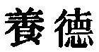
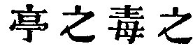
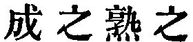

  
[Intangible Textual Heritage](../../index)  [Taoism](../index.md) 
[Index](index)  [Previous](sbe39057)  [Next](sbe39059.md) 

------------------------------------------------------------------------

### 51.

51\. 1. All things are produced by the Tâo, and nourished by its
outflowing operation. They receive their forms according to the nature
of each, and are

p. 94

completed according to the circumstances of their condition. Therefore
all things without exception honour the Tâo, and exalt its outflowing
operation.

2\. This honouring of the Tâo and exalting of its operation is not the
result of any ordination, but always a spontaneous tribute.

3\. Thus it is that the Tâo produces (all things), nourishes them,
brings them to their full growth, nurses them, completes them, matures
them, maintains them, and overspreads them.

4\. It produces them and makes no claim to the possession of them; it
carries them through their processes and does not vaunt its ability in
doing so; it brings them to maturity and exercises no control over
them;-this is called its mysterious operation.

 , 'The Operation (of the
Tâo) in Nourishing Things.' The subject of the chapter is the quiet
passionless operation of the Tâo in nature, in the production and
nourishing of things throughout the seasons of the year; a theme dwelt
on by Lâo-dze, in II, 4, X, 3, and other places.

The Tâo is the subject of all the predicates in par. 1, and what seem
the subjects in all but the first member should be construed
adverbially.

On par. 2 Wû Khäng says that the honour of the Son of Heaven is derived
from his appointment by God, and that then the nobility of the feudal
princes is derived from him; but in the honour given to the Tâo and the
nobility ascribed to its operation, we are not to think of any external
ordination. There is a strange reading of two of the members of par. 3
in Wang Pî, viz.   for
 . This is quoted and
predicated of 'Heaven,' in the Nestorian Monument of Hsî-an in the
eighth century.

------------------------------------------------------------------------

[Next: Chapter 52](sbe39059.md)
