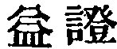
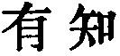
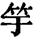
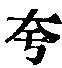
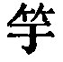

  
[Intangible Textual Heritage](../../index)  [Taoism](../index.md) 
[Index](index)  [Previous](sbe39059)  [Next](sbe39061.md) 

------------------------------------------------------------------------

### 53.

53\. 1. If I were suddenly to become known, and (put into a position to)
conduct (a government) according to the Great Tâo, what I should be most
afraid of would be a boastful display.

2\. The great Tâo (or way) is very level and easy; but people love the
by-ways.

3\. Their court(-yards and buildings) shall be well kept, but their
fields shall be ill-cultivated, and their granaries very empty. They
shall wear elegant and

p. 97

ornamented robes, carry a sharp sword at their girdle, pamper themselves
in eating and drinking, and have a superabundance of property and
wealth;--such (princes) may be called robbers and boasters. This is
contrary to the Tâo surely!

 , 'Increase of Evidence.'
The chapter contrasts government by the Tâo with that conducted in a
spirit of ostentation and by oppression.

In the 'I' of paragraph 1 does Lâo-dze speak of himself? I think he
does. Wû Khäng understands it of 'any man,' i. e. any one in the
exercise of government;--which is possible. What is peculiar to my
version is the pregnant meaning given to 
, common enough in the mouth of Confucius. I have
adopted it here because of a passage in Liû Hsiang's Shwo-wän (XX, 13
b), where Lâo-dze is made to say 'Excessive is the difficulty of
practising the Tâo at the present time,' adding that the princes of his
age would not receive it from him. On the 'Great Tâo,' see chapters 25,
34, et al. From the twentieth book of Han Fei (12 b and 13 a) I conclude
that he had the whole of this chapter in his copy of our King, but he
broke it up, after his fashion, into fragmentary utterances, confused
and confounding. He gives also some remarkable various readings, one of
which ( , instead of
Ho-shang Kung and Wang Pî's 
, character 48) is now generally adopted. The passage
is quoted in the Khang-hsî dictionary under 
 with this reading.

------------------------------------------------------------------------

[Next: Chapter 54](sbe39061.md)
