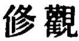

  
[Intangible Textual Heritage](../../index)  [Taoism](../index) 
[Index](index)  [Previous](sbe39060)  [Next](sbe39062) 

------------------------------------------------------------------------

### 54.

54\. 1. What (Tâo's) skilful planter plants  
    Can never be uptorn;  
What his skilful arms enfold,  
    From him can ne'er be borne.  
Sons shall bring in lengthening line,  
Sacrifices to his shrine.

2\. Tâo when nursed within one's self,  
    His vigour will make true;

p. 98

And where the family it rules  
    What riches will accrue!  
The neighbourhood where it prevails  
    In thriving will abound;  
And when 'tis seen throughout the state,  
    Good fortune will be found.  
Employ it the kingdom o'er,  
    And men thrive all around.

3\. In this way the effect will be seen in the person, by the
observation of different cases; in the family; in the neighbourhood; in
the state; and in the kingdom.

4\. How do I know that this effect is sure to hold thus all under the
sky? By this (method of observation).

 , ''The Cultivation (of
the Tâo), and the Observation (of its Effects).' The sentiment of the
first paragraph is found in the twenty-seventh and other previous
chapters,--that the noiseless and imperceptible acting of the Tâo is
irresistible in its influence; and this runs through to the end of the
chapter with the additional appeal to the influence of its effects. The
introduction of the subject of sacrifices, a religious rite, though not
presented to the Highest Object, will strike the reader as peculiar in
our King.

The Teh mentioned five times in par. 2 is the 'virtue' of the Tâo
embodied in the individual, and extending from him in all the spheres of
his occupation, and is explained differently by Han Fei according to its
application; and his example I have to some extent followed.

The force of pars. 3 and 4 is well given by Ho-shang Kung. On the first
clause he says, 'Take the person of one who cultivates the Tâo, and
compare it with that of one who does not cultivate it;--which is in a
state of decay? and which is in a state of preservation?'

------------------------------------------------------------------------

[Next: Chapter 55](sbe39062)
