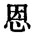

  
[Intangible Textual Heritage](../../index)  [Taoism](../index) 
[Index](index)  [Previous](sbe39069)  [Next](sbe39071) 

------------------------------------------------------------------------

### 63.

63\. 1. (It is the way of the Tâo) to act without (thinking of) acting;
to conduct affairs without (feeling the) trouble of them; to taste
without discerning any flavour; to consider what is small as great, and
a few as many; and to recompense injury with kindness.

2\. (The master of it) anticipates things that are difficult while they
are easy, and does things that would become great while they are small.
All difficult things in the world are sure to arise from a previous
state in which they were easy, and all great things from one in which
they were small. Therefore the sage, while he never does what is great,
is able on that account to accomplish the greatest things.

p. 107

3\. He who lightly promises is sure to keep but little faith; he who is
continually thinking things easy is sure to find them difficult.
Therefore the sage sees difficulty even in what seems easy, and so never
has any difficulties.

 , 'Thinking in the
Beginning.' The former of these two characters is commonly misprinted
 , and this has led
Chalmers to mistranslate them by 'The Beginning of Grace.' The chapter
sets forth the passionless method of the Tâo, and how the sage
accordingly accomplishes his objects easily by forestalling in his
measures all difficulties. In par. 1 the clauses are indicative, and not
imperative, and therefore we have to supplement the text in translating
in some such way, as I have done. They give us a cluster of aphorisms
illustrating the procedure of the Tâo 'by contraries,' and conclude with
one, which is the chief glory of Lâo-dze's teaching, though I must think
that its value is somewhat diminished by the method in which he reaches
it. It has not the prominence in the later teaching of Tâoist writers
which we should expect, nor is it found (so far as I know) in Kwang-dze,
Han Fei, or Hwâi-nan. It is quoted, however, twice by Liû Hsiang;--see
my note on par. 2 of ch. 49.

It follows from the whole chapter that the Tâoistic 'doing nothing' was
not an absolute quiescence and inaction, but had a method in it.

------------------------------------------------------------------------

[Next: Chapter 64](sbe39071)
