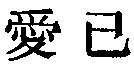
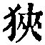
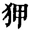
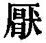

  
[Intangible Textual Heritage](../../index)  [Taoism](../index) 
[Index](index)  [Previous](sbe39078)  [Next](sbe39080) 

------------------------------------------------------------------------

### 72.

72\. 1. When the people do not fear what they ought to fear, that which
is their great dread will come on them.

2\. Let them not thoughtlessly indulge themselves in their ordinary
life; let them not act as if weary of what that life depends on.

3\. It is by avoiding such indulgence that such weariness does not
arise.

4\. Therefore the sage knows (these things) of himself, but does not
parade (his knowledge); loves, but does not (appear to set a) value on,
himself. And thus he puts the latter alternative away and makes choice
of the former.

 , 'Loving one's Self,'
This title is taken from the expression in par. 4; and the object of the
chapter seems to be to show how such loving should be manifested, and to
enforce the lesson by the example of the 'sage,' the true master of the
Tâo.

In par. 1 'the great dread' is death, and the things which ought to be
feared and may be feared, are the indulgences of the appetites and
passions, which, if not eschewed, tend to shorten life and accelerate
the approach of death.

Pars. 2 and 3 are supplementary to 1. For 
, the second character of Ho-shang Kung's text in par.
2, Wang Pî reads  , which
has the same name as the other; and according to the Khang-hsî
dictionary, the two characters are interchangeable. I have also followed
Wû Khäng in adopting   for
the former of the two   in
par. 3. Wû adopted this reading from a commentator Liû of Lü-ling. It
gives a good meaning, and is supported by the structure of other
sentences made on similar lines.

p. 115

In par. 4 'the sage' must be 'the ruler who is a sage,' a master of the
Tâo, 'the king' of ch. 25. He 'loves himself,' i. e. his life, and takes
the right measures to prolong his life, but without any demonstration
that he is doing so.

The above is, I conceive, the correct explanation of the chapter; but as
to the Chinese critics and foreign translators of it, it may be said,
'Quot homines, tot sententiae.' In illustration of this I venture to
subjoin what is found on it in the old version of the Jesuit
missionaries, which has not been previously printed:--

Prima explicatio juxta interpretes.

1\. Populus, ubi jam principis iram non timet, nihil non audet ut jugum
excutiat, resque communis ad extremum discrimen adducitur.

2\. Ambitio principis non faciat terram angustiorem, et vectigalium
magnitudine alendo populo insufficientem; numquam populus patriae
pertaesus alias terras quaeret.

3\. Vitae si non taedet, neque patrii soli taedebit.

4\. Quare sanctus sibi semper attentus potentiam suam non ostentat.

5\. Quia vere se amat, non se pretiosum facit; vel quia sibi recte
consulit non se talem aestimat cujus felicitati et honori infelices
populi unice servire debeant, immo potius eum se reputat qui populorum
felicitati totum se debeat impendere.

6\. Ergo illud resecat, istud amplectitur.

Alia explicatio.

1\. Populus si non ita timet principis majestatem, sed facile ad cum
accedit, majestas non minuitur, immo ad summum pervenit.

2\. Vectigalibus terra si non opprimitur, suâ quisque contentus alias
terras non quaeret, si se non vexari populus experitur.

3\. Vitae si non taedet, nec patrii soli taedebit.

4\. Quare sanctus majestatis fastum non affectat, immo similem se
caeteris ostendit.

p. 116

5\. Sibi recte consulens, populorum amans, non se pretiosum et
inaccessibilem facit.

6\. Quidquid ergo timorem incutere potest, hoc evitat; quod amorem
conciliat et benignitatem, se demonstrat hoc eligi et ultro amplectitur.

------------------------------------------------------------------------

[Next: Chapter 73](sbe39080)
