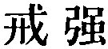
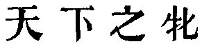

  
[Intangible Textual Heritage](../../index)  [Taoism](../index.md) 
[Index](index)  [Previous](sbe39082)  [Next](sbe39084.md) 

------------------------------------------------------------------------

### 76.

76\. 1. Man at his birth is supple and weak; at his death, firm and
strong. (So it is with) all things. Trees and plants, in their early
growth, are soft and brittle; at their death, dry and withered.

2\. Thus it is that firmness and strength are the concomitants of death;
softness and weakness, the concomitants of life.

3\. Hence he who (relies on) the strength of his forces does not
conquer; and a tree which is strong will fill the out-stretched arms,
(and thereby invites the feller.)

4\. Therefore the place of what is firm and strong is below, and that of
what is soft and weak is above.

 , 'A Warning against
(trusting in) Strength.' To trust in one's force is contrary to the Tâo,
whose strength is more in weakness and humility.

In par. 1 the two characters which I have rendered by

p. 119

\[paragraph continues\] '(so it is with) all things' are found in the
texts of both Ho-shang Kung and Wang Pî, but Wû Khäng and Ziâo Hung both
reject them. I should also have neglected them, but they are also found
in Liû Hsiang's Shwo Wän (X, 4 a), with all the rest of pars. 1 and 2,
as from Lâo-dze. They are an anakoluthon, such as is elsewhere found in
our King; e.g.   in ch.
21, par. 2.

The 'above' and 'below' in par. 4 seem to be merely a play on the words,
as capable of meaning 'more and less honourable.'

------------------------------------------------------------------------

[Next: Chapter 77](sbe39084.md)
